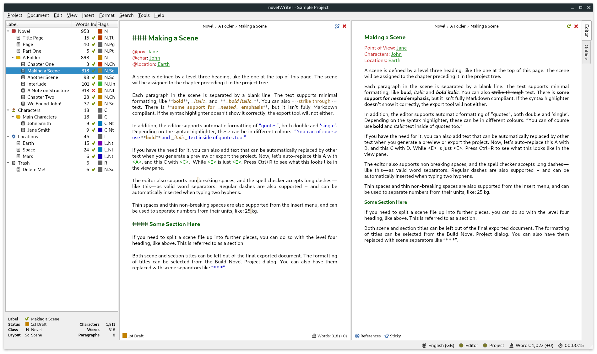
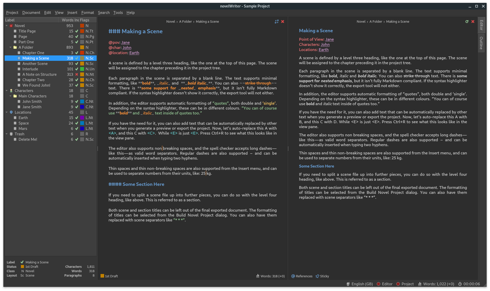

# novelWriter

[](https://travis-ci.com/vkbo/novelWriter)
[](https://codecov.io/gh/vkbo/novelWriter)
[](https://novelwriter.readthedocs.io/en/latest/?badge=latest)

novelWriter is a markdown-like text editor designed for writing novels and larger projects of many smaller plain text documents.

The documentation is available here: [novelwriter.readthedocs.io](https://novelwriter.readthedocs.io/).

### Note

The application is under initial development, and not all planned features are included.
The core functionality is, however, in place and has been used for a while by the author and collaborators.

New features are being added regularly, until the core toolset is complete.
When all planned initial features are in place, a release 1.0 will be made.
Until then, novelWriter is in a pre-release alpha state, and should be considered experimental.
If you do use it for real projects, please run backups frequently to avoid data losses.
There is a built in backup feature that can pack the entire project into a zip file on close.
Please check the documentation for further details.

## Markdown Flavour

novelWriter is **not** a full-feature Markdown editor.
It allows for a minimal set of formatting needed for writing text documents for novels.
These are currently limited to:

* Headings level 1 to 4 using the `#` syntax only.
* Bold, italic and underline text.
* Hard line breaks using two or more spaces at the end of a line.

That is it.
Features not supported in the editor are also not exported when using the export tool.

In addition, novelWriter adds the following, which is otherwise not supported by Markdown:

* A line starting with `%` is treated as a comment and not rendered on exports unless requested.
  Comments do not count towards the word count.
* A set of meta data keyword/value sets starting with the character `@`.
  This is used for tagging and inter-linking documents.
* Non-breaking spaces are supported as long as your system is using at least Qt 5.9.
  For earlier version, non-breaking spaces are converted to normal spaces when saving the document.
  This is done by the Qt library.
* Tabs may be rendered, depending on export format.

The core export format that should render properly all supported features is the HTML export.
This format also forms the basis of conversion to Office type document formats with Pandoc.
Note that Pandoc itself strips some formatting from the document during conversion, so the final result may be different than expected.

## Implementation

The application is written in Python3 using Qt5 via PyQt5.
It is developed on Linux, but it should in principle work fine on other operating systems as well as long as dependencies are met.

The application can be started from the source folder with the command:
```
./novelWriter.py
```

It also takes a few parameters for debugging and such, which can be listed with the switch `--help`.

There are no launcher icons yet.
Consult your operating system documentation for how to make those.
These will be added at some point, and I would appreciate any assistance from people working on Windows and MacOS as I don't use either of those operating systems.

## Package Dependencies

It is recommended that novelWriter runs with Qt 5.9 or later, and Python 3.6 or later.
Running with Qt as low as 5.2.1 and Python 3.4.3 has been tested, and worked in the past, but there are no guarantees that this will keep working as these are not a part of the test builds.

For the apt package manager on Debian systems, the following Python3 packages are needed:

* `python3-pyqt5` for the GUI
* `python3-pyqt5.qtsvg` may need to be installed separately
* `python3-lxml` for writing project files

These are optional, but recommended:

* `python3-enchant` for better spell checking
* `python3-latexcodec` for escaping unicode characters in LaTeX export
* `python3-pypandoc` for additional exports to Word, Open Office, eBooks, etc.

Alternatively, the packages can be installed with `pip` by running
```
python3 -m pip install -r requirements.txt
```
in the application folder.

You can also do them one at a time, skipping the ones you don't need:
```
python3 -m pip install pyqt5
python3 -m pip install lxml
python3 -m pip install pyenchant
python3 -m pip install latexcodec
python3 -m pip install pypandoc
```
On Windows,`pyenchant` may cause problems.
If no external spell checking tool is installed, novelWriter will use a basic spell checker based on standard Python package `difflib`.
Currently, only English dictionaries are available, but more can be added to the `nw/assets/dict` folder.
See the RADME.md file in that folder for how to generate more dictionaries.
This option is both slow and limited.

Note: On Windows, make sure Python3 is in your PATH if you want to launch novelWriter from command line.
You can also right click the `novelWriter.py` file, create a shortcut, then right click again, select "Properties" and change the target to your python executable and `novelWriter.py`.

It should look something like this:
```
C:\...\AppData\Local\Programs\Python\Python38\python.exe novelWriter.py
```

## Key Features

The text documents of novelWriter uses a format similar to markdown, but with a few extensions and a few omissions.
Project meta data is stored as XML.

### Colour Themes

The editor has syntax highlighting for the features it supports, and includes a set of different syntax highlighting themes.
The GUI also has an optional dark theme in addition to the default system theme.

Note that the dark theme may not render all elements of the GUI as dark colours if you are running an early version of Qt5.
This is not due to a bug in novelWriter, but due to the fact that the the styling options in the Qt API in some versions were incomplete.

New themes can easily be added to the `nw/themes` folder.
Have a look in the existing folders for examples of how to define the colours.

### Auto-Saving and Document Stats

Open documents and the project file itself is saved regularly on a timer if they have been altered.
The status of this is indicated by two indicators in the right corner of the status bar.
Unsaved changes are in yellow, and saved is indicated by green.
Latest character count, word count, and paragraph count is shown next to these indicators in the status bar.
The counts are updated regularly, but not as-you-type.

### Easy Organising of Project Files

The structure of the project is shown on the left hand side of the main GUI.
Project files are organised into root folders, indicating what class of file they are.
The most important root folder is the Novel folder, which contains all of the files that makes up the finished novel.
Each root folder can have subfolders.
Folders have no impact on the project structure, they are purely tools for organising the files in whatever way the user needs.

The editor supports four levels of headings, which determines what level the following text belongs to.
Headings of level one signify a book or partition title.
Headings of level two signify the start of a new chapter.
Headings of level three signify the start of a new scene.
Headings of level four can be used internally in each scene to separate sections.

Each novel file can be assigned a layout format, which shows up as a flag next to the item in the tree view.
These are mostly to help the user see what they contain, but some of them have impact on the format of the exported document.
See the documentation for further details.

#### Project Notes

Supporting note files can be added for the story plot, characters, locations, story timeline, etc.
These have their separate root folders.
These are optional files.

### Visualisation of Story Elements

The different notes can be assigned tags, which the novel files can refer back to using special meta keywords.
Currently, this information can be used to display a Timeline View of the story, showing where each scene connects to the plot, and which characters, etc. occur in them.
Further features using this meta data will be added in the future.

## Contribution

If you ant to contribute to novelWriter, please follow the coding convention laid out in the [Style Guide](docs/markdown/style.md).
They broadly follow Python PEP8, but there are a few modifications.

## Screenshot

**novelWriter with default system theme:**


**novelWriter with dark theme:**

