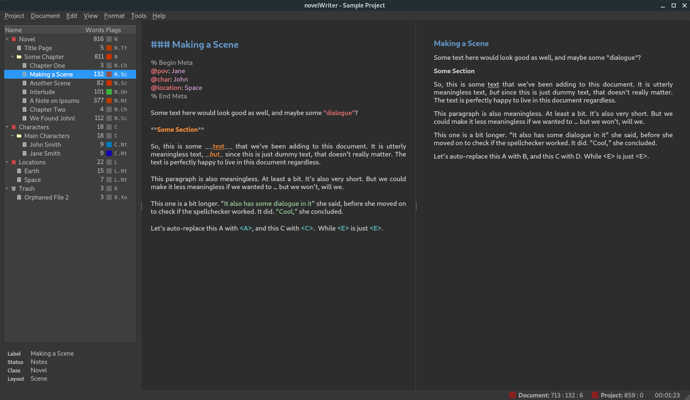

# novelWriter

[](https://travis-ci.com/vkbo/novelWriter)
[](https://codecov.io/gh/vkbo/novelWriter)
[](https://novelwriter.readthedocs.io/en/latest/?badge=latest)

novelWriter is a markdown-like text editor designed fro writing novels and larger projects of many smaller plain text documents.

It is under initial development, and not all planned features are included, but it is perfectly usable in the current state.

The application is written in Python3 using Qt5 via PyQt5.
It is developed on Linux, but it should in principle work fine on other operating systems as well as long as dependencies are met.

The documentation is available here: [novelwriter.readthedocs.io](https://novelwriter.readthedocs.io/).

The application can be started from the source folder with the command:
```
./novelWriter.py
```

It also takes a few parameters for debugging and such, which can be listed with the switch `--help`.

There are no launcher icons yet.
Consult your operating system documentation for how to make those.
I will add those later, and would appreciate any assistance from people working on Windows and MacOS as I don't use either of those operating systems.

## Dependencies

For the apt package manager on Debian systems, the following Python3 packages are needed:

* `python3-pyqt5` for the GUI
* `python3-pyqt5.qtsvg` may need to be installed separately
* `python3-appdirs` for locating the system's config folder
* `python3-lxml` for writing project files

These are optional, but recommended:

* `python3-enchant` for spell checking
* `python3-pycountry` for translating language codes to language names

Alternatively, the packages can be installed with `pip` by running
```
pip install -r requirements.txt
```
in the application folder.

## Key Features

The text documents of novelWriter uses a format similar to markdown, but with a few extensions and a few omissions.
Project meta data is stored as XML.

### Colour Themes

The editor has syntax highlighting for the features it supports, and includes a set of different syntax highlighting themes.
The GUI also has an optional dark theme in addition to the default system theme.

Note that the dark theme may not render all elements of the GUI as dark colours if you are running an early version of Qt5.
This is not due to a bug in novelWriter, but due to the fact that the the styling options in the Qt API in some versions were incomplete.

New themes can easily be added to the `nw/themes` folder.
Have a look in the existing folders for examples of how to define the colours.

### Auto-Saving and Document Stats

Open documents and the project file itself is saved regularly on a timer if they have been altered.
The status of this is indicated by two indicators in the right corner of the status bar.
Unsaved changes are in yellow, and saved is indicated by green.
Latest character count, word count, and paragraph count is shown next to these indicators in the status bar.
The counts are updated regularly, but not as-you-type.

### Easy Organising of Project Files

The structure of the project is shown on the left hand side of the main GUI.
Project files are organised into root folders, indicating what class of file they are.
The most important root folder is the Novel folder, which contains all of the files that makes up the finished novel.
Each root folder can have subfolders.
Folders have no impact on the project structure, they are purely tools for organising the files in whatever way the user needs.

The editor supports four levels of headings, which determines what level the following text belongs to.
Headings of level one signify a book or partition title.
Headings of level two signify the start of a new chapter.
Headings of level three signify the start of a new scene.
Headings of level four can be used internally in each scene to separate sections.

Each novel file can be assigned a layout format, which shows up as a flag next to the item in the tree view.
These are mostly to help the user see what they contain, but some of them have impact on the format of the exported document.
See the documentation for further details.

#### Project Notes

Supporting note files can be added for the story plot, characters, locations, story timeline, etc.
These have their separate root folders.
These are optional files.

### Visualisation of Story Elements

The different notes can be assigned tags, which the novel files can refer back to using special meta keywords.
Currently, this information can be used to display a Timeline View of the story, showing where each scene connects to the plot, and which characters, etc. occur in them.
Further features using this meta data will be added in the future.

## Screenshot


