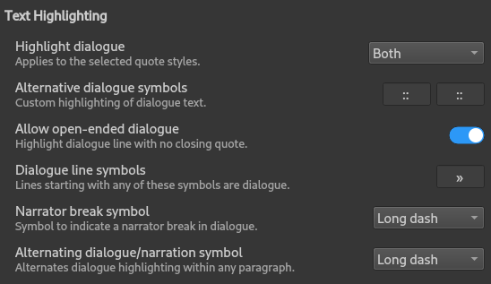
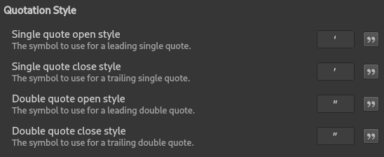
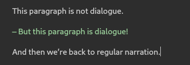
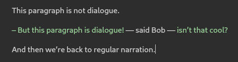
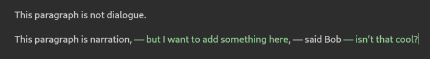

.. _docs_features_dialogue:

*********************
Dialogue Highlighting
*********************

Character dialogue can be automatically highlighted in your text both while you're writing and in
generated manuscript documents.

The default language settings in novelWriter are for English. That includes the dialogue
highlighting settings. However, many dialogue styles are supported. You can modify this by changing
the settings under "Text Highlighting" in **Preferences**.

   The **Text Highlighting** section of **Preferences**.

Quoted Dialogue
===============

By default, dialogue highlighting is enabled for double quotes as defined in the **Quotation
Style** section of **Preferences**.

   The **Quotation Style** section of **Preferences**.

You can change which quote symbols are highlighted by selecting one of the options of "None",
"Single", "Double", or "Both" from the "Highlight dialogue" setting under **Text Highlighting**.

You can also enable or disable the "Allow open-ended dialogue" setting to allow the style where
multi-paragraph dialogue is not closed until the last paragraph.

.. admonition:: Limitations

   Dialogue highlighting for single quotes is difficult to process when the same single quote
   symbol is also used for apostrophes. There isn't a good solution to this. Your best option in
   those cases is to insert an alternative apostrophe symbol in cases where the highlighter guesses
   wrongly. See :ref:`docs_more_typographical_symbols_apostrophe` for more details.

Alternative Dialogue
====================

There is also an "Alternative dialogue symbols" setting you can use to add your own symbols. These
are highlighted in a different colour than regular dialogue, so you can use both at the same time.
The intended use case here is if you use an alternative style to distinguish a different style of
communication.

The feature idea came from a science fiction series where mind-to-mind communication used a
different quotation style.

Dialogue Line Symbols
=====================

In some languages, a single symbol at the start of a paragraph can indicate that the whole
paragraph is dialogue. Often this is a short dash (en dash), but not always.

   An example of dialogue starting with a short dash.

You can enable this feature by adding the symbols to the "Dialogue line symbols" setting. Multiple
symbols are allowed.

Dialogue with Narrator Break
============================

The dialogue symbol setting will not detect when the narrator breaks in. In some styles there is no
way to actually detect this; in others there are. These are usually dashes. You can select one of
the supported dash symbols for narrator breaks.

   An example of dialogue starting with a short dash and a long dash narrator break.

Alternating Dialogue and Narration
==================================

The alternating dialogue and narration style is supported with the "Alternating dialogue/narration
symbol" setting. It can be set to one of the supported dashes. This style will switch into dialogue
mode when it encounters the selected dash in a paragraph, and switch back out when it sees the next
one, and so forth.

   An example of alternating dialogue and narration using a long dash.
