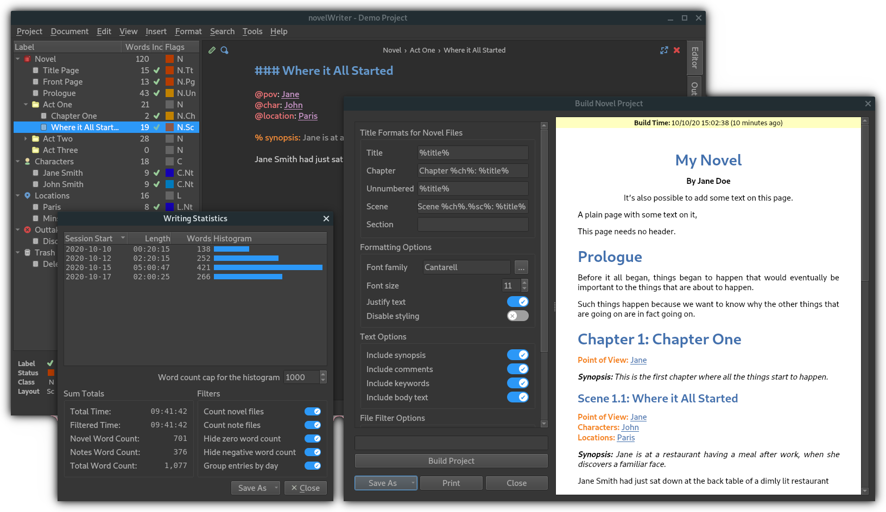

######################
novelWriter User Guide
######################

| **Release Version:** |release|
| **Updated:** |today|

novelWriter is an open source plain text editor designed for writing novels assembled from
individual text documents. It uses a minimal formatting syntax inspired by Markdown, and adds a
meta data syntax for comments, synopsis, and cross-referencing. It is designed to be a simple text
editor that allows for easy organisation of text and notes, using human readable text files as
storage for robustness.

The project storage is suitable for version control software, and also well suited for file
synchronisation tools. All text is saved as plain text files, and your project data as standard
data formats in XML and JSON. See :ref:`a_storage` for more details.

Any operating system that has Python 3 and the Qt 5 libraries should be able to run novelWriter.
It runs fine on Linux, Windows and MacOS, and users have tested it on other platforms as well.
See :ref:`a_started` for more details.

**Useful Links**

* Website: https://novelwriter.io
* Documentation: https://docs.novelwriter.io
* Public Releases: https://releases.novelwriter.io
* Internationalisation: https://crowdin.com/project/novelwriter
* Source Code: https://github.com/vkbo/novelWriter
* Source Releases: https://github.com/vkbo/novelWriter/releases
* Issue Tracker: https://github.com/vkbo/novelWriter/issues
* Feature Discussions: https://github.com/vkbo/novelWriter/discussions
* PyPi Project: https://pypi.org/project/novelWriter
* Social Media: https://fosstodon.org/@novelwriter

.. toctree::
   :hidden:

   Main Page <self>

.. toctree::
   :maxdepth: 1
   :caption: Introduction
   :hidden:

   int_introduction
   int_overview
   int_started
   int_howto
   int_glossary

.. toctree::
   :maxdepth: 1
   :caption: Using novelWriter
   :hidden:

   usage_breakdown
   usage_project
   usage_writing
   usage_format
   usage_shortcuts
   usage_typography

.. toctree::
   :maxdepth: 1
   :caption: Organising Your Project
   :hidden:

   project_overview
   project_structure
   project_references
   project_manuscript

.. toctree::
   :maxdepth: 1
   :caption: Additional Details
   :hidden:

   more_customise
   more_projectformat
   more_counting

.. toctree::
   :maxdepth: 1
   :caption: Technical Topics
   :hidden:

   tech_locations
   tech_storage
   tech_source
   tech_tests
