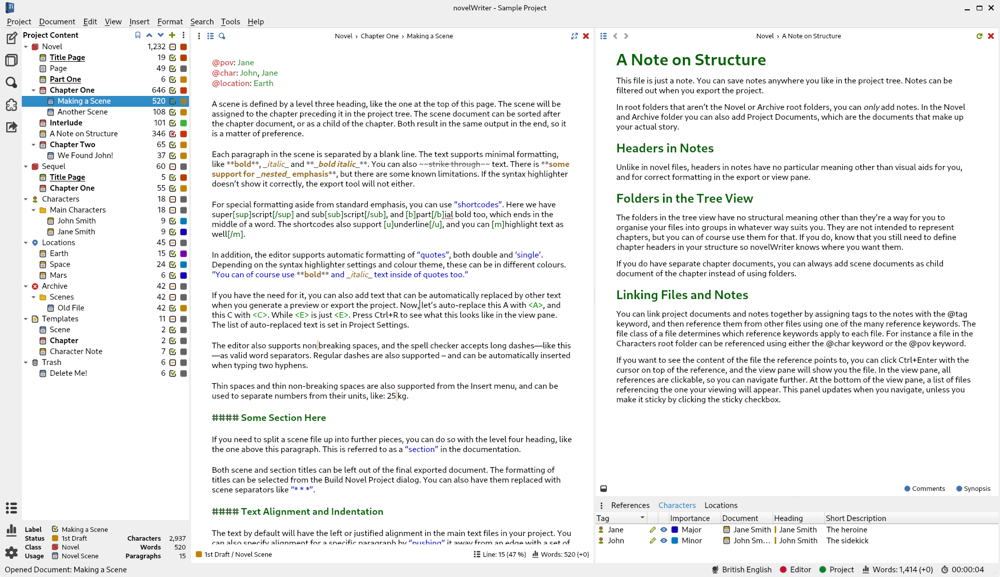

.. _a_intro:

********
Overview
********

.. _Snowflake: https://www.advancedfictionwriting.com/articles/snowflake-method/
.. _Markdown: https://en.wikipedia.org/wiki/Markdown

At its core, novelWriter is a multi-document plain text editor. The idea is to let you edit your
text without having to deal with formatting until you generate a draft document or manuscript.
Instead, you can focus on the writing right from the start.

Of course, you probably need *some* formatting for your text. At the very least you need emphasis.
Most people are familiar with adding emphasis using ``_underscores_`` and ``**asterisks**``. This
formatting standard comes from Markdown_ and is supported by novelWriter. It also uses Markdown
formatting for defining document headings. If you need more specialised formatting, additional
formatting options are available using a shortcode format. See :ref:`a_fmt_shortcodes` for more
details.

.. admonition:: Limitations

   novelWriter is designed for writing fiction, so the formatting features available are limited to
   those relevant for this purpose. It is *not* suitable for technical writing, and it is *not* a
   full-featured Markdown editor.

   It is also not intended as a tool for organising research for writing, and therefore lacks
   formatting features you may need for this purpose. The notes feature in novelWriter is mainly
   intended for character profiles and plot outlines.

Your novel project in novelWriter is organised as a collection of separate plain text documents
instead of a single, large document. The idea is to make it easier to reorganise your project
structure without having to cut and paste text between chapters and scenes.

There are two kinds of documents in your project: :term:`Novel Documents` are documents that are
part of your story. The other kind of documents are :term:`Project Notes`, which are intended for
your notes about your characters, your world building, and so on.

You can at any point split the individual documents by their headings up into multiple documents,
or merge multiple documents into a single document. This makes it easier to use variations of the
Snowflake_ method for writing. You can start by writing larger structure-focused documents, like
for instance one document per act, and later effortlessly split these up into individual chapter or
scene documents.

.. _a_intro_features:

Key Features
============

Below are some key features of novelWriter.

**Focus on writing**
   The aim of the user interface is to let you focus on writing instead of spending time formatting
   text. Formatting is therefore limited to a small set of formatting tags for simple things like
   text emphasis and paragraph alignment. Additional shortcodes are available for special
   formatting cases when you need them.

   When you really want to focus on just writing, you can switch the editor into **Focus Mode**
   where only the text editor panel itself is visible, and the project structure view is hidden
   away.

**Keep an eye on your notes**
   The main window can optionally show a document viewer to the right of the editor. The viewer
   is intended for displaying another scene document, your character notes, plot notes, or any
   other document you may need to reference while writing. It is not intended as a preview panel
   for the document you're editing, but if you wish, you can also use it for this purpose.

**Organise your documents how you like**
   You can split your novel project up into as many individual documents as you want to. When you
   build the project into a manuscript, they are all glued together in the top-to-bottom order in
   which they appear in the project tree. You can use as few text documents as you like, but
   splitting the project up into chapters and scenes means you can easily reorder them using the
   drag-and-drop feature of the project tree. You can also start out with fewer documents and then
   later split them into multiple documents based on chapter and scene headings.

**Multi-novel project support**
   The main parts of your project is split up into top level special folders called "Root" folders.
   Your main story text lives in the "Novel" root folder. You can have multiple such folders in a
   project, and rename them to whatever you want. This allows you to keep a series of individual
   novels with the same characters and world building in the same project, and create manuscripts
   for them separately.

**Keep track of your story elements**
   All documents in your project can be assigned a :term:`tag` that you can then :term:`reference`
   from any other document or note. In fact, you can add a new tag under each heading of a note if
   you need to be able to reference specific sections of it, or you want to keep several topics or
   scenes in the same document.

**Get an overview of your story**
   It is not the documents themselves that define the chapters and scenes of your story, but the
   headings within them. In the **Outline View** on the main window you can see an outline of all
   the chapter and scene headings of each novel root folder in your project. If they have any
   references in them, like which character is in what chapter and scene, these are listed in
   additional columns.

   You can also add a synopsis to each chapter or scene, which can be listed here as well. You have
   the option to add or remove columns of information from this outline. A subset of the outline
   information is also available in the **Novel View** as an alternative view to the project tree.

**Get an overview of your story elements**
   Under the document viewer panel you will find a series of tabs that show the different story
   elements you have created tags for. The tabs are sorted into **Characters**, **Plots**, etc,
   depending on which categories you are using in your story. This panel can be hidden to free up
   space when you don't need it.

**Assembling your manuscript**
   Whether you want to assemble a manuscript, or export all your notes, or generate an outline of
   your chapters and scenes with a synopsis included, you can use the **Build Manuscript** tool to
   do so. The tool lets you select what information you want to include in the generated document,
   and how it is formatted. You can send the result to a printer, or generate an Open Document or
   Word Document file that can be opened by most office type word processors. You can also generate
   the result as HTML, or Markdown, both suitable for further conversion to other formats.

.. _a_intro_screenshots:

Screenshots
===========

   novelWriter with light colour theme

.. figure:: images/screenshot_dark.png
   :class: dark-light

   novelWriter with dark colour theme
