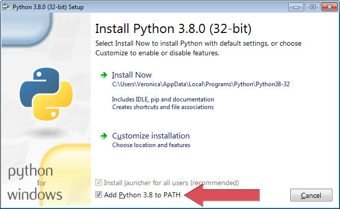

.. _a_started:

***************
Getting Started
***************

.. _Enchant: https://abiword.github.io/enchant/
.. _GitHub: https://github.com/vkbo/novelWriter
.. _main website: https://novelwriter.io
.. _PPA: https://launchpad.net/~vkbo/+archive/ubuntu/novelwriter
.. _Pre-Release PPA: https://launchpad.net/~vkbo/+archive/ubuntu/novelwriter-pre
.. _PyPi: https://pypi.org/project/novelWriter/
.. _python.org: https://www.python.org/downloads/windows
.. _Releases: https://github.com/vkbo/novelWriter/releases
.. _AppImage: https://appimage.org/

Package installers are available for all major platforms, including Linux, Windows and MacOS. See
below for install instructions for each platform.

You can also install novelWriter from the Python Package Index (PyPi). See :ref:`a_started_pip`.
Installing from PyPi does not set up icon launchers, so you will either have to do this yourself,
or start novelWriter from command line.

Spell checking in novelWriter is provided by a third party library called Enchant_. Generally, it
should pull dictionaries from your operating system automatically. However, on Windows they must be
installed manually. See :ref:`a_custom_dict` for more details.

.. _a_started_windows:

Installing on Windows
=====================

You can install novelWriter with both Python and library dependencies embedded using the Windows
Installer (setup.exe) file from the `main website`_, or from the Releases_ page on GitHub_.
Installing it should be straightforward.

If you have any issues, try uninstalling the previous version and making a fresh install. If you
already had a version installed via a different method, you should uninstall that first.

.. _a_started_linux:

Installing on Linux
===================

A Debian package can be downloaded from the `main website`_, or from the Releases_ page on GitHub_.
This package should work on both Debian, Ubuntu and Linux Mint, at least.

If you prefer, you can also add the novelWriter repository on Launchpad to your package manager.

Ubuntu
------

You can add the Ubuntu PPA_ and install novelWriter with the following commands.

.. code-block:: bash

   sudo add-apt-repository ppa:vkbo/novelwriter
   sudo apt update
   sudo apt install novelwriter

If you want the `Pre-Release PPA`_ instead, add the ``ppa:vkbo/novelwriter-pre`` repository.

Debian and Mint
---------------

Since this is a pure Python package, the Launchpad PPA can in principle also be used on Debian or
Mint. However, the above command will fail to add the signing key.

Instead, run the following commands to add the repository and key:

.. code-block:: bash

   sudo gpg --no-default-keyring --keyring /usr/share/keyrings/novelwriter-ppa-keyring.gpg --keyserver hkp://keyserver.ubuntu.com:80 --recv-keys F19F1FCE50043114
   echo "deb [signed-by=/usr/share/keyrings/novelwriter-ppa-keyring.gpg] http://ppa.launchpad.net/vkbo/novelwriter/ubuntu jammy main" | sudo tee /etc/apt/sources.list.d/novelwriter.list

Then run the update and install commands as for Ubuntu:

.. code-block:: bash

   sudo apt update
   sudo apt install novelwriter

.. note::

   You may need to use the Ubuntu 20.04 (focal) packages for Debian 11 or earlier. The newer Ubuntu
   packages use a different compression algorithm that may not be supported.

.. tip::

   If you get an error message like ``gpg: failed to create temporary file`` when importing the key
   from the Ubuntu keyserver, try creating the folder it fails on, and import the key again:

   .. code-block:: bash

      sudo mkdir /root/.gnupg/

AppImage Releases
-----------------

For other Linux distros than the ones mentioned above, the primary option is AppImage_. These are
completely standalone images for the app that include the necessary environment to run novelWriter.
They can of course be run on any Linux distro, if you prefer this to native packages.

.. _a_started_macos:

Installing on MacOS
===================

You can install novelWriter with both its Python and library dependencies embedded using the DMG
application image file from the `main website`_, or from the Releases_ page on GitHub_. Installing
it should be straightforward.

* Download the DMG file and open it. Then drag the novelWriter icon to the :guilabel:`Applications`
  folder on the right. This will install it into your :guilabel:`Applications`.
* The first time you try to launch it, it will say that the bundle cannot be verified, simply press
  the :guilabel:`Open` button to add an exception.
* If you are not presented with an :guilabel:`Open` button in the dialog launch the application
  again by right clicking on the application in Finder and selecting :guilabel:`Open` from the
  context menu.

The context menu can also be accessed by option-clicking if you have a one button mouse. This is
done by holding down the option key on your keyboard and clicking on the application in Finder.

.. _a_started_pip:

Installing from PyPi
====================

novelWriter is also available on the Python Package Index, or PyPi_. This install method works on
all supported operating systems.

To install from PyPi you must first have the ``python`` and ``pip`` commands available on your
system. If you are on Windows, and don't have Python installed, see :ref:`a_started_win_py` for
help.

To install novelWriter from PyPi, use the following command:

.. code-block:: bash

   pip install novelwriter

To upgrade an existing installation, use:

.. code-block:: bash

   pip install --upgrade novelwriter

When installing via pip, novelWriter can be launched from command line with:

.. code-block:: bash

   novelwriter

Make sure the install location for pip is in your PATH variable. This is not always the case by
default.

.. note::

   On systems with both Python 2 and 3, you may have to replace the ``pip`` command with ``pip3``.

.. _a_started_win_py:

Installing Python on Windows
----------------------------

In order to run novelWriter from source, or install from PyPi, you need to have Python set up on
your system. Unlike Linux and MacOS, Windows does not come with Python pre-installed.

You can download Python from `python.org`_. Python 3.8 or higher is required for running
novelWriter, but it is recommended that you install the latest version.

Make sure you select the "Add Python to PATH" option during installation, otherwise the ``python``
command will not work in the command line window.

   Screenshot of the Python installer on Windows.

When Python is installed, you should be able to run Python commands from the Command Prompt or
from PowerShell. You can verify this by running:

.. code-block:: bash

   python --version

This should print out the version number of the Python installation.
