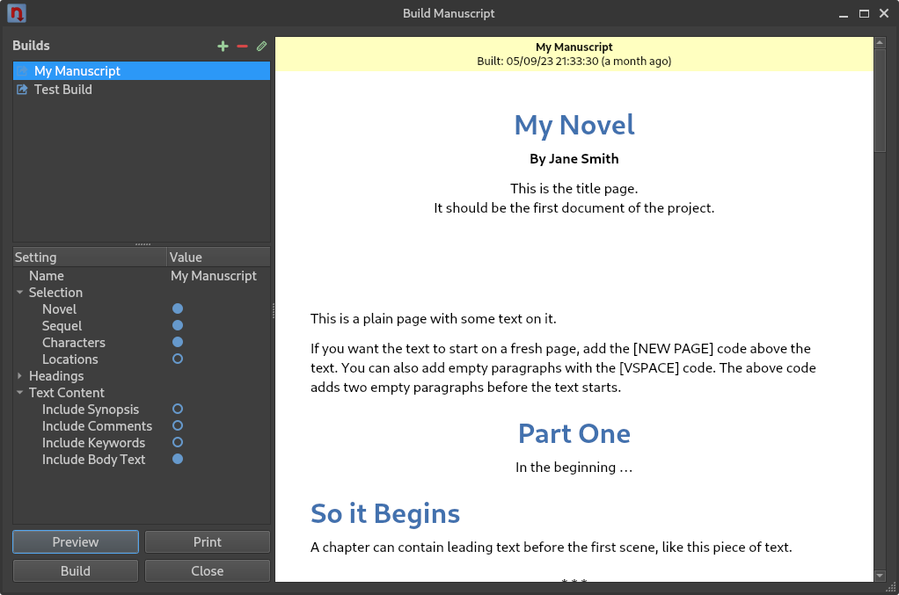
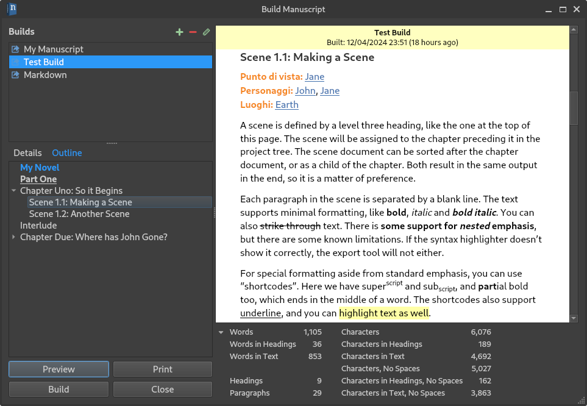
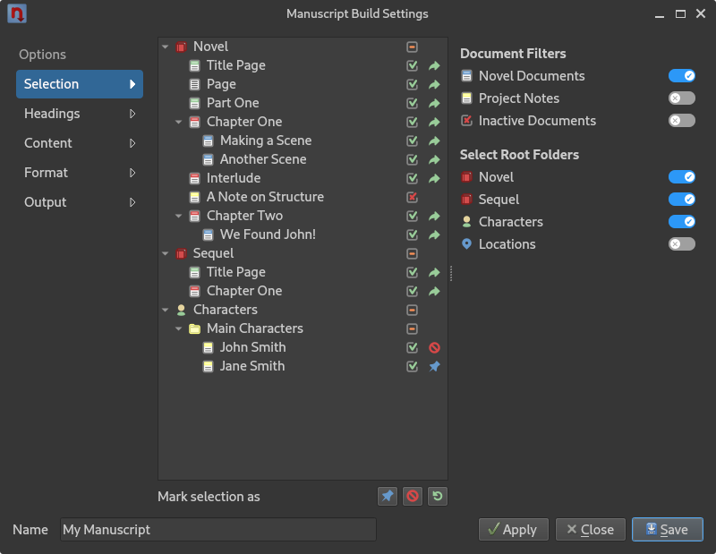
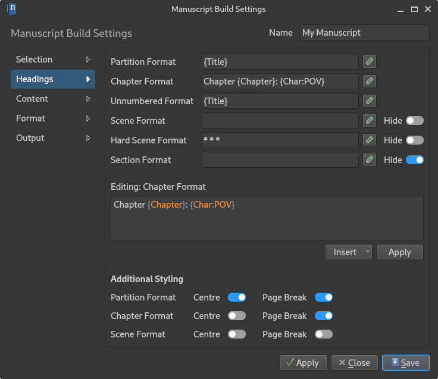
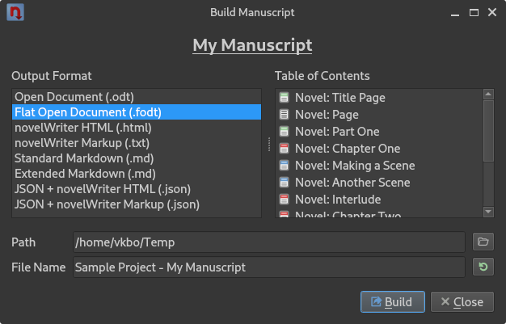

.. _a_manuscript:

***********************
Building the Manuscript
***********************

.. _Pandoc: https://pandoc.org/

You can at any time build a manuscript, an outline of your notes, or any other type of document
from the text in your project. All of this is handled by the **Manuscript Build** tool. You can
activate it from the sidebar, the **Tools** menu, or by pressing :kbd:`F5`.

.. versionadded:: 2.1

   This tool is new for version 2.1. A simpler tool was used for earlier versions. The simpler tool
   only allows you to define a single set of options for the build, but otherwise had much the same
   functionality.

.. _a_manuscript_main:

The Manuscript Build Tool
=========================

   The **Manuscript Build** tool main window.

The main window of the **Manuscript Build** tool contains a list of all the builds you have
defined, a selection of settings, and a few buttons to generate preview, open the print dialog, or
run the build to create a manuscript document.

Outline and Word Counts
-----------------------

   The **Manuscript Build** tool main window with the **Outline** visible.

The **Outline** tab on the left lets you navigate the headings in the preview document. It will
show up to scene level headings for novel documents, and level 2 headings for notes.

A collapsible panel of word and character counts are also available below the preview document.
These are calculated from the text you have included in the document, and are more accurate counts
than what's available in the project tree since they are counted *after formatting*.

For a detailed description on how they are counted, see :ref:`a_counting`.

.. _a_manuscript_settings:

Build Settings
==============

Each build definition can be edited by opening it in the **Manuscript Build Settings** dialog,
either by double-clicking or by selecting it and pressing the edit button in the toolbar.

.. tip::

   You can keep the **Manuscript Build Settings** dialog open while testing the different options,
   and just hit the :guilabel:`Apply` button. You can test the result of your settings by pressing
   the :guilabel:`Preview` button in the main **Manuscript Build** window. When you're happy with
   the result, you can close the settings.

Document Selection
------------------

   The **Selections** page of the **Manuscript Build Settings** dialog.

The **Selections** page of the **Manuscript Build Settings** dialog allows you to fine tune which
documents are included in the build. They are indicated by a green arrow icon in the last column.
On the right you have some filter options for selecting content of a specific type, and a set of
switches for which root folders to include.

You can override the result of these filters by marking one or more documents and selecting to
explicitly include or exclude them by using the buttons below the tree view. The last button can be
used to reset the override and return control to the filter settings.

In the figure, the green arrow icon and the blue pin icon indicates which documents are included,
and the red forbidden icon indicates that a document is explicitly excluded.

.. _a_manuscript_settings_head:

Formatting Headings
-------------------

   The **Headings** page of the **Manuscript Build Settings** dialog.

The **Headings** page of the **Manuscript Build Settings** dialog allows you to set how the
headings in your :term:`Novel Documents` are formatted. By default, the title is just copied as-is,
indicated by the ``{Title}`` format. You can change this to for instance add chapter numbers and
scene numbers, or insert character names, like shown in the figure above.

Clicking the edit button next to a format will copy the formatting string into the edit box where
it can be modified, and where a syntax highlighter will help indicate which parts are automatically
generated by the build tool. The :guilabel:`Insert` button is a dropdown list of these formats, and
selecting one will insert it at the position of the cursor.

Any text you add that isn't highlighted in colours will remain in your formatted titles.
``{Title}`` will always be replaced by the text in the heading from your documents.

You can preview the result of these format strings by clicking :guilabel:`Apply`, and then clicking
:guilabel:`Preview` in the **Manuscript Build** tool main window.

Scene Separators
^^^^^^^^^^^^^^^^

If you don't want any titles for your scenes (or for your sections if you have them), you can leave
the formatting boxes empty. If so, an empty paragraph will be inserted between the scenes or
sections instead, resulting in a gap in the text. You can also switch on the :guilabel:`Hide`
setting, which will ignore them completely. That is, there won't even be an extra gap inserted.

Alternatively, if you want a separator text between them, like the common ``* * *``, you can enter
the desired separator text as the format. If the format is any piece of static text, it will always
be treated as a separator.

.. _a_manuscript_settings_head_hard:

Hard and Soft Scenes
^^^^^^^^^^^^^^^^^^^^

If you wish to distinguish between so-called soft and hard scene breaks, you can use the
alternative scene heading format in your text. You can then give these headings a different
formatting in the **Headings** settings.

See :ref:`a_fmt_head` for more info on how to format headings in your text.

Output Settings
---------------

The **Content**, **Format** and **Output** pages of the **Manuscript Build Settings** dialog
control a number of other settings for the output. Some of these only apply to specific output
formats, which is indicated by the section headings on the settings pages.

.. _a_manuscript_build:

Building Manuscript Documents
=============================

   The **Manuscript Build** dialog used for writing the actual manuscript documents.

When you press the :guilabel:`Build` button on the **Build Manuscript** tool main window, a special
file dialog opens up. This is where you pick your desired output format and where to write the
file.

On the left side of the dialog is a list of all the available file formats, and on the right, a
list of the documents which are included based on the build definition you selected. You can choose
an output path, and set a base file name as well. The file extension will be added automatically.

To generate the manuscript document, press the :guilabel:`Build` button. A small progress bar will
show the build progress, but for small projects it may pass very fast.

File Formats
------------

Currently, four document formats are supported.

Open Document Format
   The Build tool can produce either an ``.odt`` file, or an ``.fodt`` file. The latter is just a
   flat version of the document format as a single XML file. Most rich text editors support the
   former, and only a few the latter.

Microsoft Word Document Format
   The Microsoft Word Document format writes a single ``.docx`` file. It uses a fairly basic format
   that should be compatible with most rich text editors.

Portable Document Format (PDF)
   The PDF is generated from a copy of the preview document, and should have the same formatting
   capabilities as the preview. It's identical to what is produced if you select the print option
   and print to PDF.

novelWriter HTML
   The HTML format writes a single ``.htm`` file with minimal style formatting. The HTML document
   is suitable for further processing by document conversion tools like Pandoc_, for importing in
   word processors, or for printing from browser.

Standard/Extended Markdown
   The Markdown format comes in both Standard and Extended flavour. The *only* difference in terms
   of novelWriter functionality is the support for strike through text, which is not supported by
   the Standard flavour.

novelWriter Markup
   This is simply a concatenation of the project documents selected by the filters into a ``.txt``
   file. The documents are stacked together in the order they appear in the project tree, with
   comments, tags, etc. included if they are selected. This is a useful format for exporting the
   project for later import back into novelWriter.

.. versionadded:: 2.6

   Microsoft Word and PDF output options were added.

Additional Formats
------------------

In addition to the above document formats, the novelWriter HTML and Markup formats can also be
wrapped in a JSON file. These files will have a meta data entry and a body entry. For HTML, also
the accompanying CSS styles used by the preview are included.

The text body is saved in a two-level list. The outer list contains one entry per document, in the
order they appear in the project tree. Each document is then split up into a list as well, with one
entry per paragraph it contains.

These files are mainly intended for scripted post-processing for those who want that option. A JSON
file can be imported directly into a Python dict object or a PHP array, to mentions a few options.

.. _a_manuscript_print:

Printing
========

The :guilabel:`Print` button allows you to print the content in the preview window. You can either
print to one of your system's printers, or select PDF as your output format from the printer icon
on the print dialog.

.. note::

   The paper format should in all cases default to whatever your system default is. If you want to
   change it, you have to select it from the **Print Preview** dialog.
