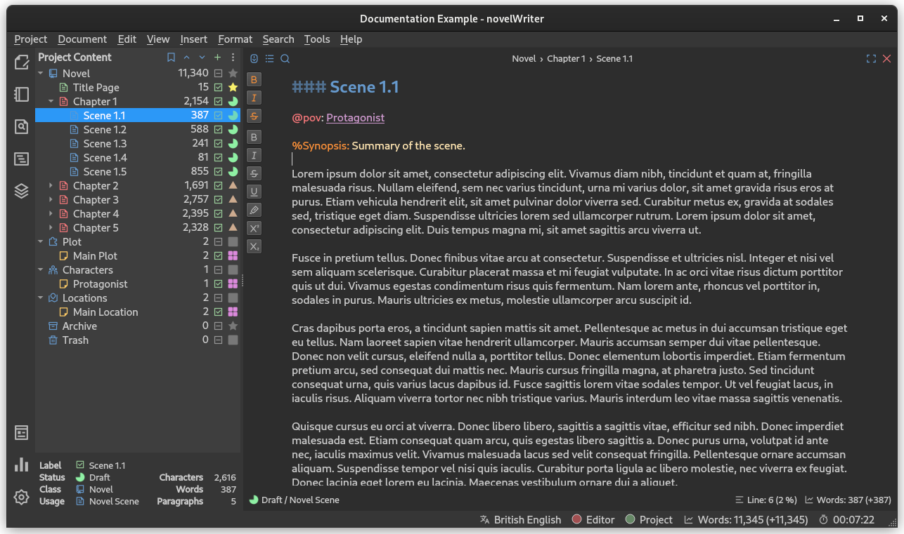

.. _docs_usage_project:

***********************
Organising Your Project
***********************

Your project is organised into a set of top level folders called "Root Folders", which each have
specific meaning in the project. Your project documents and notes are stored under these root
folders. All the content of your project is available in the **Project Content** panel on the left
side of the main window.

   The **Project Content** tree populated with example documents.

Each line in the project tree shows the name of each item, its word count (or alternatively
character count), an icon for :ref:`docs_usage_project_active`, and a custom icon for
:ref:`docs_usage_project_status` of each item. These latter two are covered alter in this section.

You can add, view and edit documents in the project tree by right-clicking on them. Some features
are also located in the buttons along the top, next to the **Project Content** label.

.. _docs_usage_project_roots:

How Root Folders Work
=====================

Projects are structured into a set of top level folders called "Root Folders". They are visible in
the project tree at the left side of the main window. Each type of root folder has a distinct icon.

The documents that make up your story go into a root folder of type **Novel**. Your notes go into
the other root folders. These other root folder types are separated into types depending on what
kind of notes go into them. This is not only for organisation. It also matters to how you can
reference these notes later. We will come back to this in the :ref:`docs_usage_tags_refs` section.

A new project may not have all of the root folders present, but you can add the ones you want from
the project tree tool bar.

The intended usage of each type of root folder is listed below. However, aside from the **Novel**
folder, no restrictions are applied by novelWriter on what you put in them. You can use them
however you want.

Root Folder Types
-----------------

**Novel** (Story)
   This is where you put the documents that are part of your story. You can create multiple Novel
   folders if you wish, but various parts of the application assumes each Novel folder belong to
   one novel.

   The Novel folder is somewhat special in that it can contain documents for chapters, scenes and
   story partitions. How this is indicated is covered in the section :ref:`docs_usage_headings`.

**Plot** (Notes)
   This is where you can keep notes and outlines of your story plots. Such notes can be
   particularly useful if you have outlines for sub plot. You can make references to these subplots
   from the scene documents, which makes it easier to track story progress.

**Characters** (Notes)
   Character notes go in this root folder type. For your main characters, you may want to make one
   document for each character. For smaller characters you can put multiple into the same document.
   In your chapters and scenes you can reference these character notes as point-of-view or focus
   characters.

**Locations** (Notes)
   The locations where your story takes place can be documented here. This, together with Plot and
   Characters are the key story elements to track, and to reference from your chapter and scene
   documents.

**Timeline** (Notes)
   If the story has multiple plot timelines or jumps in time within the same plot, this folder type
   can be used to track this.

**Objects** (Notes)
   Important objects in the story, for instance physical objects that change hands often, can be
   tracked here.

**Entities** (Notes)
   Does your plot have many powerful organisations or companies? Or other entities that are part of
   the plot? They can be organised here.

**Custom** (Notes)
   The custom root folder type can be used for tracking anything else not covered by the above
   options.

**Templates**
   Any document added under this root folder will be made available as template options when
   creating new documents. See :ref:`docs_usage_project_documents_templates` for more details.

**Archive**
   If you don't want to delete a document, or put it in the **Trash** folder where it may be
   deleted, but still want it out of your main project, you can put it in this folder. The contents
   of the document will be ignored by the scanner that looks for tags, and it will be ignored in
   any outline view and in your manuscript.

**Trash**
   This folder behaves like you expect. Anything dropped in here can be deleted permanently from
   the project, and the content doesn't show up anywhere else in novelWriter.

The root folder types are closely tied to the tags and reference system. Each folder type for novel
and notes corresponds to one or more categories of tags that can be used to reference the content
in them. See :ref:`docs_usage_tags_refs` for more details.

.. tip::

   The root folders have standard names, but you can rename them to whatever you want.

.. _docs_usage_project_folders:

Regular Folders
===============

You can add regular folders anywhere you want in the project. The folders are there purely as a way
for you to organise the documents in meaningful sections and to be able to collapse and hide them
in the project tree when you're not working on those documents.

When novelWriter is processing the documents in a project, like for instance when you create a
manuscript from it, these folders are ignored. Only the order of the documents themselves matter.

.. _docs_usage_project_documents:

Documents
=========

You can add documents anywhere you want in your project structure. You can even add documents as
child items of other documents, just as if they were folders. This makes it easy to associate a set
of scenes with their chapter. You can also do this in your notes, where you for instance may have a
hierarchy of your locations.

The name on a document in the project tree is not linked to any headings in the document text.
Think of the document name as a file name. You can rename a document, or any other item in the
project, at any time.

Documents come in two types:

**Novel Documents**
   These are the documents that make up your story or novel. They can only be added under a root
   folder of type **Novel**. You can technically also add them under **Archive**. See
   :ref:`docs_usage_headings` for more details on how these documents are handled by novelWriter.

**Project Notes**
   These are the documents where you keep your notes. You can add them anywhere in your project,
   including under **Novel** type folders. If you do add them there, they are not treated as a part
   of the story by default.

You can convert between the two types of documents where both types are allowed. You can also
convert folders into documents, which may sometimes be convenient too.

Another convenient feature is that documents can be split into sub-documents by its headings, or
multiple documents merged into one. This is particularly useful if you start out with larger
structural documents, like one containing all chapters and scenes in an act, and then split those
when you start writing. See :ref:`docs_ui_split_merge` for more details.

.. _docs_usage_project_documents_templates:

Document Templates
------------------

If you wish to create template documents to be used when creating new documents, like for instance
a character note template, you can add a **Templates** root folder to your project. Any document
added to this root folder will show up in the **Add Item** menu in the project tree toolbar. When
selected, a new document is created with its content copied from the chosen template.

.. versionadded:: 2.3

.. _docs_usage_project_active:

Active and Inactive Documents
=============================

A document can be set as "Active" or "Inactive", which alters the icon in the third column of the
project tree. These are mostly intended for your convenience as they will indicate whether the
document is meant to be included in the manuscript or not. You can think of an inactive status as a
whole-document out-take. It allows you to take it out without moving it to **Archive**.

Inactive documents are by default excluded from your manuscript, but you can override this if you
wish. See :ref:`docs_ui_manuscript_selection` for more details.

.. _docs_usage_project_status:

Importance and Status
=====================

Each document or folder in your project can have either a "Status" or "Importance" label set. These
are labels and icons that you control and define yourself, and novelWriter doesn't use them for
anything. You can modify these labels in **Project Settings**.
See :ref:`docs_ui_projects_settings_status` for more details.

The "Status" labels are intended to tag a novel document as for instance a draft or as completed,
and the "Importance" labels are intended to tag character notes, or other project notes, as for
instance a main, major, or minor character or story element.

Whether a document uses a "Status" or "Importance" label depends on which root folder it lives in.
If it's in a **Novel** type folder, it uses the "Status" label, otherwise it uses an "Importance"
label.
