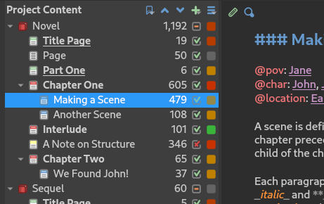
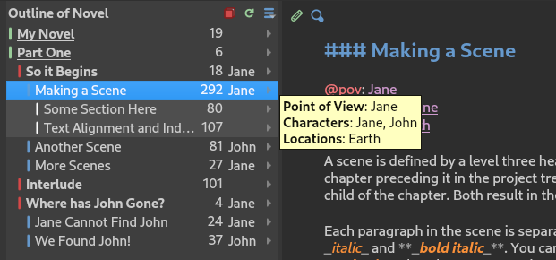
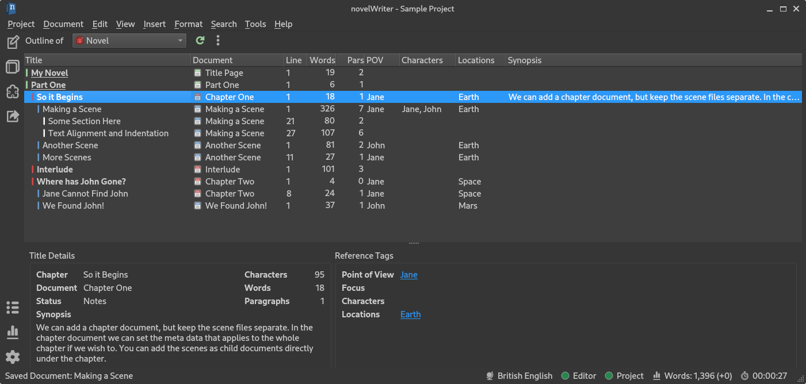

.. _a_breakdown:

************
How it Works
************

.. _Fusion: https://doc.qt.io/qt-6/gallery.html
.. _Pandoc: https://pandoc.org/
.. _Open Document: https://en.wikipedia.org/wiki/OpenDocument
.. _Office Open XML: https://en.wikipedia.org/wiki/Office_Open_XML
.. _version control: https://en.wikipedia.org/wiki/Version_control

The main features of novelWriter are listed in the :ref:`a_intro` chapter. In this chapter, we go
into some more details on how they are implemented. This is intended as an overview. Later on in
this documentation these features will be covered in more detail.

.. _a_breakdown_design:

GUI Layout and Design
=====================

The user interface of novelWriter is intended to be as minimalistic as practically possible, while
at the same time provide useful features needed for writing a novel.

The main window does not by default have an editor toolbar like many other applications do. This
reduces clutter, and since the documents are formatted with style tags, it is not needed most of
the time. Still, a small formatting toolbar can be popped out by clicking the left-most button in
the header of the document editor. It gives quick access to standard formatting codes.

Most formatting features supported are available through convenient keyboard shortcuts. They are
also available in the main menu under **Format**, so you don't have to look up formatting codes
every time you need them. For reference, a list of all shortcuts can be found in the :ref:`a_kb`
chapter.

.. note::
   novelWriter is not intended to be a full office type word processor. It doesn't support images,
   links, tables, and other complex structures and objects often needed for such documents.
   Formatting is limited to headings, in-line basic text formats, text alignment, and a few other
   simple features.

On the left side of the main window, you will find a sidebar. This bar has buttons for the standard
views you can switch between, a quick link to the **Build Manuscript** tool, and a set of
project-related tools and quick access to settings at the bottom.

.. versionadded:: 2.2

   A number of new formatting options were added in 2.2 to allow for some special formatting cases.
   At the same time, a small formatting toolbar was added to the editor. It is hidden by default,
   but can be opened by pressing the button in the top--left corner of the editor header.

Project Tree and Editor View
----------------------------

   A screenshot of the Project Tree and Editor View.

When the application is in **Project Tree View** mode, the work area of the main window is split in
two, or optionally three, panels. The left-most panel contains the project tree and all the
documents in your project. The second panel is the document editor.

An optional third panel on the right side contains a document viewer which can view any document in
your project independently of what is open in the document editor. This panel is not intended as a
preview window, although you can use it for this purpose if you wish. For instance if you need to
check that the formatting tags behave as you expect. However, the main purpose of the viewer is for
viewing your notes next to your editor while you're writing.

The editor also has a **Focus Mode** you can toggle either from the menu, from the icon in the
editor's header, or by pressing :kbd:`F8`. When **Focus Mode** is enabled, all the user interface
elements other than the document editor itself are hidden away.

The project tree will highlight with a different background colour the document that is currently
open in the editor.

.. versionadded:: 2.6

   You can now drag and drop documents from the project tree onto the editor or viewer panels to
   open them.

Novel View and Editor View
--------------------------

   A screenshot of the Novel Tree and Editor View.

When the application is in **Novel Tree View** mode, the project tree is replaced by an overview of
your novel structure for a specific Novel :term:`root folder`. Instead of showing individual
documents, the tree now shows all headings of your novel text. This includes multiple headings
within the same document.

Each heading is indented according to the heading level, not its parent/child relationship to other
elements of your project. You can open and edit your novel documents from this view as well. All
headings contained in the currently open document should be highlighted in the view to indicate
which ones belong together in the same document.

If you have multiple **Novel** type root folders, the header of the novel view becomes a dropdown
box. You can then switch between them by clicking the :guilabel:`Outline of ...` text. You can also
click the novel icon button next to it.

Generally, the novel view should update when you make changes to the novel structure, including
edits of the current document in the editor. The information is only updated when the automatic
save of the document is triggered, or you manually press :kbd:`Ctrl+S` to save changes. (You can
adjust the auto-save interval in **Preferences**.) You can also regenerate the whole novel view by
pressing the refresh button in the novel view header.

It is possible to show an optional third column in the novel view. The settings are available from
the menu button in the toolbar.

If you click the triangular icon to the right of each item, a tooltip will pop out showing all the
meta data collected for that heading.

Novel Outline View
------------------

   A screenshot of the Novel Outline View.

When the application is in **Novel Outline View** mode, the tree, editor and viewer are replaced by
a large table that shows the entire novel structure with all the tags and references listed. Pretty
much all collected meta data is available here in different columns.

You can select which novel root folder to display from the dropdown box, and you can select which
columns to show or hide from the menu button. You can also rearrange the columns by drag and drop.
The app remembers your column order and sizes between sessions, and for each individual project.

Colour Themes
-------------

By default, novelWriter uses a light colour theme. You can also choose between a standard dark
theme that have neutral colours, or a series of other included themes, from **Preferences**. 

If you wish, you *can* create your own colour themes, and even have them added to the application.
See :ref:`a_custom_theme` for more details.

Switching the GUI colour theme does not affect the colours of the editor and viewer. They have
separate colour selectable from the "Document colour theme" setting in **Preferences**. They are
separated because there are a lot more options to choose from for the editor and viewer.

.. note::

   If you switch between light and dark mode on the GUI, you should also switch editor theme to
   match, otherwise icons may be hard to see in the editor and viewer.

Project Search
--------------

A global search tool is available from the side bar. It allows you to search through your entire
project. The tool does not provide a replace feature. There is a search and replace tool available
in the document editor that acts on the open document.

.. versionadded:: 2.4

Switching Focus
---------------

If the project or novel view does not have focus, pressing :kbd:`Ctrl+T` switches focus to
whichever of the two is visible. If one of them already has focus, the key press will switch
between them instead.

Likewise, pressing :kbd:`Ctrl+E` will switch focus to the document editor or viewer, or if any of
them already have focus, it will switch focus between them,

These two shortcuts make it possible to jump between all these GUI elements without having to reach
for the mouse or touchpad.

.. _a_breakdown_project:

Project Layout
==============

This is a brief introduction to how you should structure your writing projects. All of this will be
covered in more detail later.

The main point of novelWriter is that you are free to organise your project documents as you wish
into sub-folders or sub-documents, and split the text between these documents in whatever way suits
you. All that matters to novelWriter is the linear order the documents appear at in the project
tree (top to bottom). The chapters, scenes and sections of the novel are determined by the headings
within those documents.

.. figure:: images/fig_header_levels.png

   An illustration of how heading levels correspond to the novel structure.

The four heading levels, **Level 1** to **Level 4**, are treated as follows:

* **Level 1** is used for the novel title, and for partitions.
* **Level 2** is used for chapter tiles.
* **Level 3** is used for scene titles -- optionally replaced by separators.
* **Level 4** is for section titles within scenes, if such granularity is needed.

The project tree will select an icon for the document based on the first heading in it.

This heading level structure is only taken into account for :term:`novel documents`. For
:term:`project notes`, the heading levels have no structural meaning, and you are free to use them
however you want. See :ref:`a_struct` and :ref:`a_references` for more details.

.. tip::

   You can add documents as child items of other documents. This is often more useful than adding
   folders, since you anyway may want to have the chapter heading in a separate document from your
   individual scene documents so that you can rearrange scene documents freely without affecting
   chapter placement.

.. versionadded:: 2.6

   The heading levels for partitions, chapters and scenes only apply within novelWriter. When you
   generate your manuscript, chapters are considered as the topmost heading level, with scenes
   below it. Partitions are inserted as text elements in most formats.

.. _a_breakdown_export:

Building a Manuscript
=====================

The project can at any time be assembled into a range of different formats through the
**Build Manuscript** tool. Natively, novelWriter supports `Open Document`_, Microsoft Word Document
(known as `Office Open XML`_), HTML5, and various flavours of Markdown. You can also generate a PDF
document.

The HTML5 format is suitable for conversion by a number of other tools like Pandoc_, or for
importing into word processors if the Open Document or Word Document format isn't suitable. The
Open Document format is supported by most office type applications, so is the Word Document format.
In addition, printing is also possible.

For advanced processing, you can export the content of the project to a JSON file. This is useful
if you want to write your own custom processing script in for instance Python, as the entire novel
can be read into a Python dictionary with a couple of lines of code. The JSON file can be populated
with either HTML formatted text, or with the raw text as typed it into the novel documents.

See :ref:`a_manuscript` for more details.

.. versionadded:: 2.1

   You can now define multiple build definitions in the **Build Manuscript** tool. This allows you
   to define specific settings for various types of draft documents, outline documents, and
   manuscript formats. See :ref:`a_manuscript` for more details.

.. _a_breakdown_storage:

Project Storage
===============

The files of a novelWriter project are stored in a dedicated project folder. The project structure
is kept in a file at the root of this folder called ``nwProject.nwx``. All the document files and
associated meta data are stored in other folders below the project folder. For a more technical
description of what all the files mean and how they're organised, see the :ref:`a_storage` section.

This way of storing data was chosen for several reasons.

Firstly, all the text you add to your project is saved directly to your project folder in separate
files. Only the project structure and the text you are currently editing is stored in memory at any
given time, which means there is a smaller risk of losing data if the application or your computer
crashes.

Secondly, having multiple small files means it is very easy to synchronise them between computers
with standard file synchronisation tools.

Thirdly, if you use `version control`_ software to track the changes to your project, the file
formats used for the files are well suited. All the JSON documents have line breaks and indents as
well, which makes it easier to track them with version control software.

.. note::

   Since novelWriter has to keep track of a bunch of files and folders when a project is open, it
   may not run well on some virtual file systems. A file or folder must be accessible with exactly
   the path it was saved or created with. An example where this is not the case is the way Google
   Drive is mapped on Linux Gnome desktops using gvfs/gio.

.. caution::

   You should not add additional files to the project folder yourself. Nor should you, as a rule,
   manually edit files within it. If you really must manually edit the text files, e.g. with some
   automated task you want to perform, you need to rebuild the :term:`Project Index` when you open
   the project again.

   Editing text files in the ``content`` folder is less risky as these are just plain text. Editing
   the main project XML file, however, may make the project file unreadable and you may crash
   novelWriter and lose project structure information and project settings.
