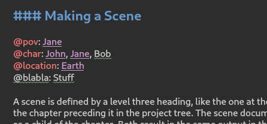

.. _a_fmt:

********************
Formatting Your Text
********************

The novelWriter text editor is a plain text editor that uses formatting codes for setting meta data
values and allowing for some text formatting. The syntax is based on Markdown, but novelWriter is
**not** a Markdown editor. It supports basic formatting like emphasis (italic), strong importance
(bold) and strike through text, as well as four levels of headings. For some further complex
formatting needs, a set of shortcodes can be used.

In addition to formatting codes, novelWriter allows for comments, a synopsis tag, and a number of
keyword and value sets used for :term:`tags<tag>` and :term:`references<reference>`. There are also
some codes that apply to whole paragraphs. See :ref:`a_fmt_text` for more details.

URLs should also be highlighted and become clickable. However, only URLs starting with "http" or
"https" are recognised. In the editor, you must hold down the :kbd:`Ctrl` key when clicking a URL
to follow it.

.. _a_fmt_hlight:

Syntax Highlighting
===================

The editor has a syntax highlighter feature that is meant to help you know when you've used the
formatting tags or other features correctly. It will change the colour and font size of your
headings, change the text colour of emphasised text, and it can also show you where you have
dialogue in your text.

   An example of the colour highlighting of references. "Bob" is not defined, and "@blabla" is not
   a valid reference type.

When you use the keywords to set tags and references, these also change colour. Correct keywords
have a distinct colour, and the references themselves will get a colour if they are valid. Invalid
references will get a squiggly error line underneath. The same applies to duplicate tags.

There are a number of syntax highlighter colour themes available, both for light and dark GUIs. You
can select them from **Preferences**.

.. _a_fmt_head:

Headings
========

.. figure:: images/fig_header_levels.png

   An illustration of how heading levels correspond to the novel structure.

Four levels of headings are allowed. For :term:`project notes`, they are free to be used as you see
fit. That is, novelWriter doesn't assign the different headings any particular meaning. However,
for :term:`novel documents` they indicate the structural level of the novel and must be used
correctly to produce the intended result. See :ref:`a_struct_heads` for more details.

``# Title Text``
   Heading level one. For novel documents, the level indicates the start of a new partition.
   Partitions are for when you want to split your story into "Part 1", "Part 2", etc. You can also
   choose to use them for splitting the text up into acts, and then hide these headings in your
   manuscript.

``## Title Text``
   Heading level two. For novel documents, the level indicates the start of a new chapter. Chapter
   numbers can be inserted automatically when building the manuscript.

``### Title Text``
   Heading level three. For novel documents, the level indicates the start of a new scene. Scene
   numbers or scene separators can be inserted automatically when building the manuscript, so you
   can use the title field as a working title for your scenes if you wish, but you must provide a
   minimal title.

``#### Title Text``
   Heading level four. For novel documents, the level indicates the start of a new section. Section
   titles can be replaced by separators or ignored completely when building the manuscript.

For headings level one through three, adding a ``!`` modifies the meaning of the heading:

``#! Title Text``
   This tells the build tool that the level one heading is intended to be used for the novel or
   notes folder's main title, like for instance the novel title on the cover page. When building
   the manuscript, this will use a different styling.

``##! Title Text``
   This tells the build tool to not assign a chapter number to this chapter title if automatic
   chapter numbers are being used. Such titles are useful for prologues and epilogues for instance.
   See :ref:`a_struct_heads_unnum` for more details.

``###! Title Text``
   This is an alternative scene heading that can be formatted differently in the **Manuscript
   Build** tool. It is intended for separating "soft" and "hard" scene breaks. Aside from this, it
   behaves identically to a regular scene heading. See :ref:`a_struct_heads_scenes` for more
   details.

.. note::

   The space after the ``#`` or ``!`` character is mandatory. The syntax highlighter will change
   colour and font size when the heading is correctly formatted.

.. _a_fmt_text:

Text Paragraphs
===============

A text paragraph is indicated by a blank line. That is, you need two line breaks to separate two
fragments of text into two paragraphs. Single line breaks are treated as line breaks within a
paragraph.

In addition, the editor supports a few additional types of white spaces:

* A non-breaking space can be inserted with :kbd:`Ctrl+K`, :kbd:`Space`.
* Thin spaces are also supported, and can be inserted with :kbd:`Ctrl+K`, :kbd:`Shift+Space`.
* Non-breaking thin space can be inserted with :kbd:`Ctrl+K`, :kbd:`Ctrl+Space`.

These are all insert features, and the **Insert** menu has more. The keyboard shortcuts for them
are also listed in :ref:`a_kb_ins`.

Non-breaking spaces are highlighted by the syntax highlighter with an alternate coloured
background, depending on the selected theme.

.. tip::

   Non-breaking spaces are for instance the correct type of space to separate a number from its
   unit. Generally, non-breaking spaces are used to prevent line wrapping algorithms from adding
   line breaks where they shouldn't.

.. note::

   You should not manually apply text indentation in your paragraphs in the editor. These can be
   added automatically in the **Manuscript Build** tool if you want to have them in the manuscript.
   Each new paragraph should be separated from the previous content by an empty line and with no
   indentation.

.. _a_fmt_emph:

Text Emphasis with Markdown
===========================

A minimal set of Markdown text emphasis styles are supported for text paragraphs.

``_text_``
   The text is rendered as emphasised text (italicised).

``**text**``
   The text is rendered as strongly emphasised text (bold).

``~~text~~``
   Strike through text.

In Markdown guides it is often recommended to differentiate between strong emphasis and emphasis
by using ``**`` for strong and ``_`` for emphasis, although Markdown generally also supports ``__``
for strong and ``*`` for emphasis. However, since the differentiation makes the highlighting and
conversion significantly simpler and faster, in novelWriter this is a rule, not just a
recommendation.

In addition, the following rules apply:

1. The emphasis and strike through formatting tags do not allow spaces between the words and the
   tag itself. That is, ``**text**`` is valid, ``**text **`` is not.
2. More generally, the delimiters must be on the outer edge of words. That is, ``some **text in
   bold** here`` is valid, ``some** text in bold** here`` is not.
3. If using both ``**`` and ``_`` to wrap the same text, the underscore must be the **inner**
   wrapper. This is due to the underscore also being a valid word character, so if they are on the
   outside, they violate rule 2.
4. Text emphasis does not span past line breaks. If you need to add emphasis to multiple lines or
   paragraphs, you must apply it to each of them in turn.
5. Text emphasis can only be used in comments and paragraphs. Headings and meta data tags don't
   allow for formatting, and any formatting markup will be rendered as-is.

.. tip::

   novelWriter supports standard escape syntax for the emphasis markup characters in case the
   editor misunderstands your intended usage of them. That is, ``\*``, ``\_`` and ``\~`` will
   generate a plain ``*``, ``_`` and ``~``, respectively, without interpreting them as part of the
   markup.

.. _a_fmt_shortcodes:

Formatting with Shortcodes
==========================

For additional formatting options, you can use shortcodes. Shortcodes is a form of in-line codes
that can be used to change the format of the text that follows and opening code, and last until
that formatting region is ended with a closing code.

These shortcodes are intended for special formatting cases, or more complex cases that cannot be
solved with simple Markdown-like formatting codes. Available shortcodes are listed below.

.. csv-table:: Shortcodes Formats
   :header: "Syntax", "Description"
   :widths: 40, 60
   :class: "tight-table"

   "``[b]text[/b]``",     "Text is rendered as bold text."
   "``[i]text[/i]``",     "Text is rendered as italicised text."
   "``[s]text[/s]``",     "Text is rendered as strike through text."
   "``[u]text[/u]``",     "Text is rendered as underlined text."
   "``[m]text[/m]``",     "Text is rendered as highlighted text."
   "``[sup]text[/sup]``", "Text is rendered as superscript text."
   "``[sub]text[/sub]``", "Text is rendered as subscript text."

Unlike Markdown style codes, these can be used anywhere within a paragraph. Even in the middle of a
word if you need to. You can also freely combine them to form more complex formatting.

The shortcodes are available from the **Format** menu and in the editor toolbar, which can be
activated by clicking the left-most icon button in the editor header.

.. note::

   Shortcodes are not processed until you generate a preview or generate a manuscript document. So
   there is no highlighting of the text between the formatting markers. There is also no check that
   your markers make sense. You must ensure that you have both the opening and closing formatting
   markers where you want them.

.. versionadded:: 2.2

.. _a_fmt_comm:

Comments and Synopsis
=====================

In addition to the above formatting features, novelWriter also allows for comments in documents.
The text of a comment is always ignored by the word counter. The text can also be filtered out
when building the manuscript or viewing the document.

The first word of a comment, followed by a colon, can be one of a set of modifiers that indicates
the comment is intended for a specific purpose. For instance, if the comment starts with
``Synopsis:``, the comment is treated in a special manner and will show up in the
:ref:`a_ui_outline` in a dedicated column. The word ``synopsis`` is not case sensitive. If it is
correctly formatted, the syntax highlighter will indicate this by altering the colour of the word.

The different styles of comments are as follows:

``% Your comment text ...``
   This is a comment. The text is not rendered by default (this can be overridden), seen in the
   document viewer, or counted towards word counts. It is intended for you to make notes in your
   text for your own sake, whatever that may be, that isn't part of the story text. This is the
   general format of a comment.

``%Synopsis: Your synopsis text ...``
   This is a synopsis comment. It is generally treated in the same way as a regular comment, except
   that it is also captured by the indexing algorithm and displayed in the :ref:`a_ui_outline`. It
   can also be filtered separately when building the project to for instance generate an outline
   document of the whole project.

``%Short: Your short description ...``
   This is a short description comment. It is identical to the synopsis comment (they are
   interchangeable), but is intended to be used for project notes. The text shows up in the
   Reference panel below the document viewer in the last column labelled **Short Description**.

``%Footnote.<key>: Your footnote text ...``
   This is a special comment assigned to a footnote marker. See :ref:`a_fmt_footnote` for how to
   use them in your text.

.. note::

   Only one comment can be flagged as a synopsis or short comment for each heading. If multiple
   comments are flagged as synopsis or short comments, the last one will be used and the rest
   ignored.

.. _a_fmt_footnote:

Footnotes
=========

Footnotes are added with a shortcode, paired with a matching comment for the actual footnote text.
The matching is done with a key that links the two. If you insert a footnote from the **Insert**
menu, a unique key is generated for you.

The insert feature will add the footnote shortcode marker at the position of your cursor in the
text, and create the associated footnote comment right after the paragraph, and move the cursor
there so you can immediately start typing the footnote text.

The footnote comment can be anywhere in the document, so if you wish to move them to, say, the
bottom of the text, you are free to do so.

Footnote keys are only required to be unique within a document, so if you copy, move or merge text,
you must make sure the keys are not duplicated. If you use the automatically generated keys from
the **Insert** menu, they are unique among all indexed documents. They are not guaranteed to be
unique against footnotes in the Archive or Trash folder though, but the chance of accidentally
generating the same key twice in a project is relatively small in the first place (1 in 810 000).

This is what a footnote inserted into a paragraph may look like when completed:

.. code-block:: md

   This is a text paragraph with a footnote[footnote:fn1] in the middle.

   %Footnote.fn1: This is the text of the footnote.

.. versionadded:: 2.5

.. _a_fmt_ignore:

Ignored Text
============

If you want to completely ignore some of the text in your documents, but are not ready to delete
it, you can add ``%~`` before the text paragraph or line. This will cause novelWriter to skip the
text entirely when generating previews or building manuscripts.

This is a better way of removing text than converting them to regular comments, as you may want to
include regular comments in your previews or draft manuscript.

You can toggle the ignored text feature on and off for a paragraph by pressing :kbd:`Ctrl+Shift+D`
on your keyboard with your cursor somewhere in the paragraph.

Example:

.. code-block:: md

   %~ This text is ignored.

   This text is a regular paragraph.

.. _a_fmt_tags:

Tags and References
===================

The document editor supports a set of keywords used for setting tags, and making references between
documents based on those tags.

You must use the keyword ``@tag:`` to define a tag. The tag can be set once per section defined by
a heading. Setting it multiple times under the same heading will just override the previous
setting.

``@tag: value``
   A tag keyword followed by the tag value, like for instance the name of a character.

References can be set anywhere within a section, and are collected according to their category.
References are on the form:

``@keyword: value1, value2, ..., valueN``
   A reference keyword followed by a value, or a comma separated list of values.

Tags and references are covered in detail in the :ref:`a_references` chapter. The keywords can be
inserted at the cursor position in the editor via the **Insert** menu. If you start typing an ``@``
on a new line, and auto-complete menu will also pop up suggesting keywords.

.. _a_fmt_align:

Paragraph Alignment and Indentation
===================================

All documents have the text by default aligned to the left or justified, depending on your setting
in **Preferences**.

You can override the default text alignment on individual paragraphs by specifying alignment tags.
These tags are double angle brackets. Either ``>>`` or ``<<``. You put them either before or after
the paragraph, and they will "push" the text towards the edge the brackets point towards. This
should be fairly intuitive.

Indentation uses a similar syntax. But here you use a single ``>`` or ``<`` to push the text away
from the edge.

Examples:

.. csv-table:: Text Alignment and Indentation
   :header: "Syntax", "Description"
   :widths: 40, 60
   :class: "tight-table"

   "``>> Right aligned text``",        "The text paragraph is right-aligned."
   "``Left aligned text <<``",         "The text paragraph is left-aligned."
   "``>> Centred text <<``",           "The text paragraph is centred."
   "``> Left indented text``",         "The text has an increased left margin."
   "``Right indented text <``",        "The text has an increased right margin."
   "``> Left/right indented text <``", "The text has both margins increased."

.. note::

   The text editor will not show the alignment and indentation live. But the viewer will show them
   when you open the document there. It will of course also be reflected in the document generated
   from the manuscript build tool as long as the format supports paragraph alignment.

Alignment with Line Breaks
--------------------------

If you have line breaks in the paragraph, the markers for all the lines are combined and used for
the entire paragraph. For the following text, all lines will be centred:

.. code-block:: md

   >> I am the very model of a modern Major-General
   I've information vegetable, animal, and mineral
   I know the kings of England, and I quote the fights historical
   From Marathon to Waterloo, in order categorical <<

Alignment with First Line Indent
--------------------------------

If you have first line indent enabled in your Manuscript build settings, you probably want to
disable it for text in verses. Adding any alignment tags will cause the first line indent to be
switched off for that paragraph.

The following text will always be aligned against the left margin:

.. code-block:: md

   I am the very model of a modern Major-General <<
   I've information vegetable, animal, and mineral
   I know the kings of England, and I quote the fights historical
   From Marathon to Waterloo, in order categorical

.. _a_fmt_break:

Vertical Space and Page Breaks
==============================

You can apply page breaks to partition, chapter and scene headings for novel documents from the
**Manuscript Build** tool. If you need to add a page break or additional vertical spacing in other
places, there are special codes available for this purpose.

Adding more than one line break between paragraphs will **not** increase the space between those
paragraphs when building the project. To add additional space between paragraphs, add the text
``[vspace]`` on a line of its own, and the build tool will insert a blank paragraph in its place.

If you need multiple blank paragraphs just add a colon and a number to the above code. For
instance, writing ``[vspace:3]`` will insert three blank paragraphs.

If you need to add a page break somewhere, put the text ``[new page]`` on a line by itself before
the text you wish to start on a new page.

.. note::

   The page break code is applied to the text that follows it. It adds a "page break before" mark
   to the text when exporting to HTML or Open Document. This means that a ``[new page]`` which has
   no text following it, it will not result in a page break.

**Example:**

.. code-block:: md

   This is a text paragraph.

   [vspace:2]

   This is another text paragraph, but there will be two empty paragraphs
   between them.

   [new page]

   This text will start on a new page if the build format has pages.

.. _a_fmt_stats:

Inserting Word Counts in the Text
=================================

The cover page of a manuscript normally has the word count stated on it. Any statistics value
collected by novelWriter can be inserted into any document. You can generate the code for this from
the **Insert** menu under **Word/Character Count**.

The value inserted is the actual count for your entire manuscript, so it is not populated until you
run the **Manuscript Build** tool. Until then they will show up as "0" in the viewer panel.
