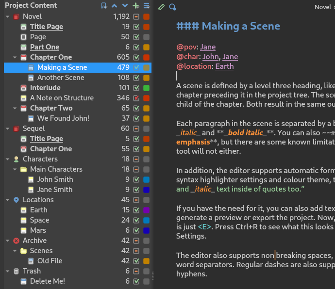
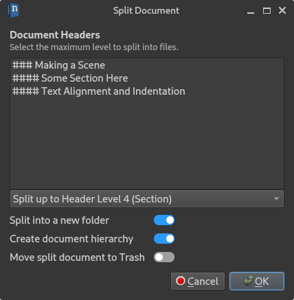
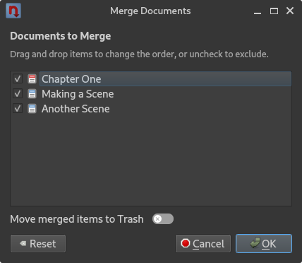

.. _a_ui_project:

*************
Project Views
*************

This chapter covers in more detail the different project views available in novelWriter.

   The **Project Content** tree as it appears when loading a sample project.

.. _a_ui_tree:

The Project Tree
================

The main window contains a project tree in the left-most panel. It shows the entire structure of
the project, and has four columns.

**Column 1**
   The first column shows the icon and label of each folder, document, or note in your project. The
   label is not the same as the heading title you set inside the document. However, the document's
   label will appear in the header above the document text itself so you know where in the project
   an open document belongs. The icon is selected based on the type of item, and for novel
   documents, the level of the first heading in the document text.

**Column 2**
   The second column shows the word count of the document, or the sum of words of the child items
   for folders and documents with sub-documents. If the counts seem incorrect, they can be updated
   by rebuilding the :term:`project index` from the **Tools** menu, or by pressing :kbd:`F9`.

**Column 3**
   The third column indicates whether the document is considered active or inactive in the project.
   You can use this flag to indicate that a document is still in the project, but should not be
   considered an active part of it. When you run the **Build Manuscript** tool, you can include or
   exclude documents based on this flag. You can change this value from the right-click
   :term:`context menu`.

**Column 4**
   The fourth column shows the user-defined status or importance labels you've assigned to each
   project item. See :ref:`a_ui_tree_status` for more details on how to uses these labels. You can
   select these labels from the :term:`context menu`, and define them in **Project Settings**.

Right-clicking an item in the project tree will open a context menu under the cursor, displaying
a selection of actions that can be performed on the selected item.

At the top of the project tree, you will find a set of buttons.

* The first button is a quick links button that will show you a dropdown menu of all the
  :term:`root folders<root folder>` in your project. Selecting one will move to that position in
  the tree. You can also activate this menu by pressing :kbd:`Ctrl+L`.
* The next two buttons can be used to move items up and down in the project tree. This is the only
  way to move root folders.
* The next button opens a dropdown menu for adding new items to the tree. This includes root
  folders and template documents. You can also activate this dropdown menu by pressing
  :kbd:`Ctrl+N`.
* The last button is a menu of further actions you can apply to the project tree.

Below the project tree you will find a small details panel showing the full information of the
currently selected item. This panel also includes the latest paragraph and character counts in
addition to the word count.

.. tip::

   If you want to set the label of a document to be the same as a header within it, you can
   right-click a header in the document when it is open in the editor and select
   :guilabel:`Set as Document Name` from the context menu.

.. _a_ui_tree_split_merge:

Splitting and Merging Documents
-------------------------------

Under the **Transform** submenu in the context menu of an item in the project tree, you will find
several options on how to change a document or folder. This includes changing between document and
note, but also splitting them into multiple documents, or merging child items into a single
document.

Splitting Documents
^^^^^^^^^^^^^^^^^^^

   The **Split Document** dialog.

The **Split Document by Headings** option will open a dialog that allows you to split the selected
document into multiple new documents based on the headings it contains. You can select at which
heading level the split is to be performed from the dropdown box. The list box will preview which
headings will be split into new documents.

You are given the option to create a folder for these new documents, and whether or not to create a
hierarchy of documents. That is, put sections under scenes, and scenes under chapters.

The source document **is not** deleted in the process, but you have the option to let the tool move
the source document to the :guilabel:`Trash` folder.

Merging Documents
^^^^^^^^^^^^^^^^^

   The **Merge Documents** dialog.

You have two options for merging documents that are child elements of another document. You can
either **Merge Child Items into Self** and **Merge Child Items into New**. The first option will
pull all content of child items and merge them into the parent document, while the second option
will create a new document in the process.

When merging documents in a folder, you only have the latter process is possible, so only the
choice **Merge Documents in Folder** is available.

In either case, the **Merge Documents** dialog will let you exclude documents you don't want to
include, and it also lets you reorder them if you wish.

.. _a_ui_tree_status:

Document Importance and Status
------------------------------

Each document or folder in your project can have either a "Status" or "Importance" flag set. These
are flags that you control and define yourself, and novelWriter doesn't use them for anything. To
modify the labels, go to their respective tabs in **Project Settings**.

The "Status" flag is intended to tag a :term:`novel document<novel documents>` as for instance a
draft or as completed, and the "Importance" flag is intended to tag character notes, or other
:term:`project notes`, as for instance a main, major, or minor character or story element.

Whether a document uses a "Status" or "Importance" flag depends on which :term:`root folder` it
lives in. If it's in a **Novel** type folder, it uses the "Status" flag, otherwise it uses an
"Importance" flag.

.. _a_ui_tree_dnd:

Project Tree Drag & Drop
------------------------

The project tree allows drag & drop to allow you to reorder your documents and folders. Moving a
document in the project tree will affect the text's position when you assemble your manuscript in
the **Manuscript Build** tool.

.. versionadded:: 2.2

   You can now select multiple items in the project tree by holding down the :kbd:`Ctrl` or
   :kbd:`Shift` key while selecting items.

Documents and their folders can be rearranged freely within their root folders. If you move a
**Novel Document** out of a **Novel** folder, it will be converted to a **Project Note**. Notes can
be moved freely between all root folders, but keep in mind that if you move a note into a **Novel**
type root folder, its "Importance" setting will be replaced by a "Status" setting. See
:ref:`a_ui_tree_status`. The old value will not be overwritten though, and should be restored if
you move it back at some point.

Root folders in the project tree cannot be dragged and dropped at all. If you want to reorder them,
you can move them up or down with respect to each other from the arrow buttons at the top of the
project tree, or by pressing :kbd:`Ctrl+Up` or :kbd:`Ctrl+Down` when they are selected.

.. tip::

   You can drag and drop documents onto the editor or viewer panel to open them.

.. _a_ui_tree_novel:

The Novel Tree View
===================

.. figure:: images/fig_novel_tree_view.png

   A screenshot of the Novel Tree View.

An alternative way to view the project structure is the novel view. You can switch to this view by
selecting the :guilabel:`Novel View` button in the sidebar. This view is a simplified version of
the view in the **Outline View**. It is convenient when you want to browse the structure of the
story itself rather than the document files.

.. note::

   You cannot reorganise the entries in the novel view, or add any new documents, as that would
   imply restructuring the content of the document files themselves. Any such editing must be done
   in the project tree. However, you can add new headings to existing documents, or change
   references, which will be updated in this view when the document is saved.

.. _a_ui_outline:

The Novel Outline View
======================

.. figure:: images/fig_outline_view.png

   A screenshot of the Novel Outline View.

The project's **Novel Outline View** is available as another view option from the sidebar. The
outline provides an overview of the novel structure, displaying a tree hierarchy of the elements of
the novel, that is, the level 1 to 4 headings representing partitions, chapters, scenes and
sections.

The document containing the heading can also be displayed as a separate column, as well as the line
number where the heading is defined. Double-clicking an entry will open the corresponding document
in the editor and switch to **Project Tree View** mode.

You can select which novel folder to display from the dropdown menu. You can optionally also choose
to show a combination of all novel folders.

.. note::

   Since the internal structure of the novel does not depend directly on the folder and document
   structure of the project tree, this view will not necessarily look the same, depending on how
   you choose to organise your documents. See the :ref:`a_struct` page for more details.

Various meta data and information extracted from :term:`tags<tag>` can be displayed in columns in
the outline. A default set of such columns is visible, but you can turn on or off more columns from
the menu button in the toolbar. The order of the columns can also be rearranged by dragging them to
a different position. You column settings are saved between sessions on a per-project basis.

.. note::

   The **Title** column cannot be disabled or moved.

The information viewed in the outline is based on the :term:`project index`. While novelWriter does
its best to keep the index up to date when contents change, you can always rebuild it manually by
pressing :kbd:`F9` if something isn't right.

The outline view itself can be regenerated by pressing the refresh button. By default, the content
is refreshed each time you switch to this view.

The **Synopsis** column of the outline view takes its information from a specially formatted
comment. See :ref:`a_fmt_comm`.
