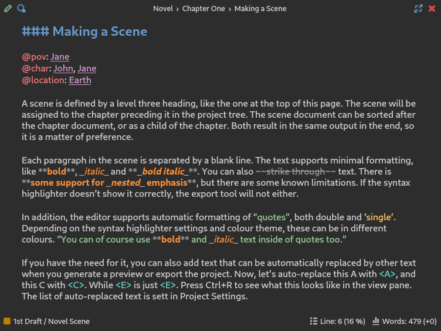
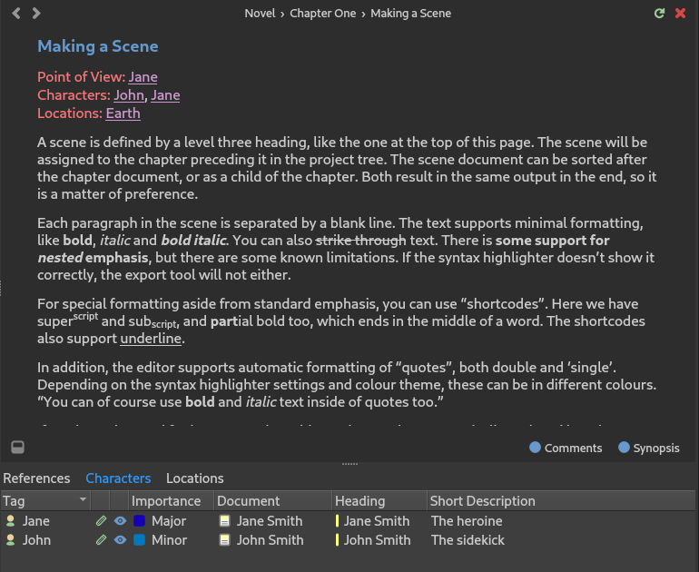

.. _a_ui_writing:

*********************
The Editor and Viewer
*********************

.. _Compose Key: https://en.wikipedia.org/wiki/Compose_key

This chapter covers in more detail how the document editor and viewer panels work.

.. _a_ui_edit:

Editing a Document
==================

   A screenshot of the Document Editor panel.

To edit a document, double-click it in the project tree, press the :kbd:`Return` key while having
it selected, or drag and drop it onto the editor panel. This will open the document in the document
editor. The editor uses a Markdown-like syntax for some features, and a novelWriter-specific syntax
for others. The syntax format is described in the :ref:`a_fmt` chapter.

The editor has a maximise button, which toggles the **Focus Mode**, and a close button in the
top--right corner. On the top--left side you will find a tools button that opens a toolbar with a
few buttons for applying text formatting, a drop down menu for navigating between headings, and a
search button to open the search dialog.

Both the document editor and viewer will show the label of the currently open document in the
header at the top of the edit or view panel. Optionally, the full project path to the document can
be shown. This can be set in **Preferences**.

.. tip::

   Clicking on the document title bar will select the document in the project tree and thus reveal
   its location there, making it easier to find in a large project.

Any :term:`references<reference>` in the editor can be opened in the viewer by moving the cursor to
the label and pressing :kbd:`Ctrl+Return`. You can also control-click them with your mouse.

Spell Checking
--------------

A third party library called Enchant is used for spell checking in the editor. The controls for
spell checking can be found in the **Tools** menu. You can also set spell checking language in
**Project Settings**.

This spell checking library comes with support for custom words that you can add by selecting
"Add Word to Dictionary" from the context menu when a word is highlighted by the spell checker as
misspelled. The custom words are managed on a per-project basis, and can the list of words can be
edited from the **Project Word List** tool available from the **Tools** menu.

.. note::

   Generally, spell checking dictionaries are collected from your operating system, but on Windows
   they are not. See :ref:`a_custom_dict` for how to add spell checking dictionaries on Windows.

Editor Auto-Completer
---------------------

If you type the character ``@`` on a new line, a pop-up menu will appear showing the different
available keywords. The list will shorten as you type. Once a keyword command has been selected or
typed, the editor may suggest further options based on your project content. See
:ref:`a_references_completer` for more details.

.. versionadded:: 2.2

.. _a_ui_view:

Viewing a Document
==================

   A screenshot of the Document Viewer panel.

Any document in the project tree can also be viewed in parallel in a right hand side document
viewer. To view a document, press :kbd:`Ctrl+R`, select **View Document** in the menu or context
menu, or drag and drop the document onto the viewer panel. If you have a middle mouse button,
middle-clicking on the document will also open it in the viewer.

The document viewed does not have to be the same document as the one currently being edited.
However, If you *are* viewing the same document, pressing :kbd:`Ctrl+R` from the editor will update
the document with your latest changes. You can also press the reload button in the top--right
corner of the viewer panel, next to the close button, to achieve the same thing.

In the viewer :term:`references<reference>` become clickable links. Clicking them will replace the
content of the viewer with the content of the document the reference points to.

The document viewer keeps a history of viewed documents, which you can navigate with the arrow
buttons in the top--left corner of the viewer. If your mouse has backward and forward navigation
buttons, these can be used as well. They work just like the backward and forward features in a
browser. The left-most button is a dropdown menu for quickly navigation between headings in the
document. The edit button on the right will open the viewed document in the editor.

At the bottom of the view panel there is a **References** panel. (If it is hidden, click the button
on the left side of the footer area to reveal it.) This panel contains a References tab with links
to all documents referring back to the one you're currently viewing, if any has been defined. If
you have created root folders and tags for various story elements like characters and plot points,
these will appear as additional tabs in this panel.

.. note::

   The **References** panel relies on an up-to-date :term:`index<project index>` of the project.
   The index is maintained automatically. However, if anything is missing, or seems wrong, the
   index can always be rebuilt by selecting **Rebuild Index** from the **Tools** menu, or by
   pressing :kbd:`F9`.

.. versionadded:: 2.2

   The reference panel was redesigned and the additional tabs added.

.. _a_ui_edit_search:

Search & Replace
================

.. figure:: images/fig_editor_search.png

   A screenshot of the Document Editor search box.

The document editor has a search and replace tool that can be activated with :kbd:`Ctrl+F` for
search mode or :kbd:`Ctrl+H` for search and replace mode.

Pressing :kbd:`Return` while in the search box will search for the next occurrence of the word, and
:kbd:`Shift+Return` for the previous. Pressing :kbd:`Return` in the replace box, will replace the
highlighted text and move to the next result.

There are a number of settings for the search tool available as toggle switches above the search
box. They allow you to search for, in order: matched case only, whole word results only, search
using regular expressions, loop search when reaching the end of the document, and move to the next
document when reaching the end. There is also a switch that will try to match the case of the word
when the replacement is made. That is, it will try to keep the word upper, lower, or capitalised to
match the word being replaced.

.. seealso::

   For more information on the capabilities of the Regular Expression option, see the Qt
   documentation for the `QRegularExpression <https://doc.qt.io/qt-5/qregularexpression.html>`_
   class.

.. _a_ui_edit_auto:

Auto-Replace as You Type
========================

A few auto-replace features are supported by the editor. You can control every aspect of the
auto-replace feature from **Preferences**. You can also disable this feature entirely if you wish.

.. tip::

   If you don't like auto-replacement, all symbols inserted by this feature are also available in
   the :guilabel:`Insert` menu, and via :ref:`a_kb_ins`. You may also be using a `Compose Key`_
   setup, which means you may not need the auto-replace feature at all.

The editor is able to replace two and three hyphens with short and long dashes, triple points with
ellipsis, and replace straight single and double quotes with user-defined quote symbols. It will
also try to determine whether to use the opening or closing symbol, although this feature isn't
always accurate. Especially distinguishing between closing single quote and apostrophe can be
tricky for languages that use the same symbol for these, like English does.

.. tip::

   If the auto-replace feature changes a symbol when you did not want it to change, pressing
   :kbd:`Ctrl+Z` once after the auto-replacement will undo it without undoing the character
   you typed before it.

.. _a_ui_edit_dialogue:

Dialogue Highlighting
=====================

The editor and viewer can optionally highlight character dialogue in your novel documents. By
default, this feature is set to display text in double quotes as dialogue. In **Preferences**, you
can change this to support various other dialogue markers that instead uses dashes to indicate
dialogue, like those used in Spanish, Portuguese, Polish, etc.

Various styles are supported by changing the settings under "Text Highlighting" in **Preferences**.

It is also possible to include the dialogue highlighting in your manuscripts.
