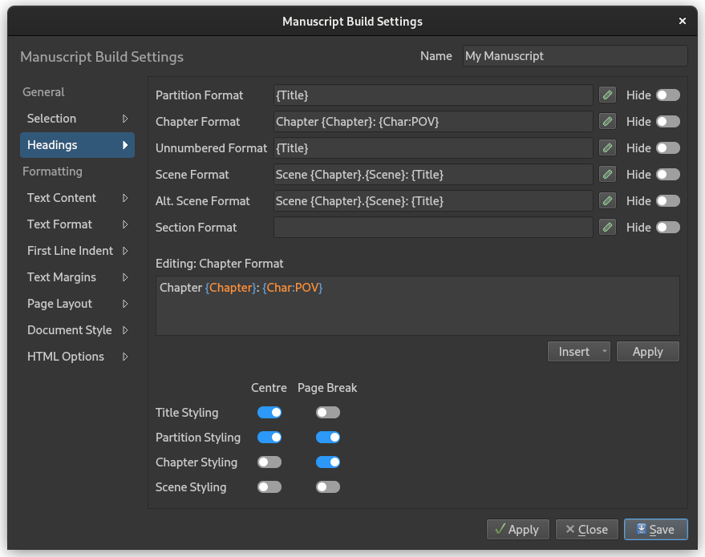

.. _docs_ui_manuscript_formatting:

*************************
Formatting the Manuscript
*************************

.. _docs_ui_manuscript_formatting_head:

Headings
========

   The **Headings** page of the **Manuscript Build Settings** dialog.

The **Headings** page of the **Manuscript Build Settings** dialog allows you to set how the
headings in your Novel Documents are formatted. By default, the title is just copied as-is,
indicated by the ``{Title}`` format. You can change this to for instance add chapter numbers and
scene numbers, or insert character names, like shown in the figure above.

Clicking the edit button next to a format will copy the formatting string into the edit box where
it can be modified, and where a syntax highlighter will help indicate which parts are automatically
generated by the build tool. The :guilabel:`Insert` button is a dropdown list of these formats, and
selecting one will insert it at the position of the cursor.

Any text you add that isn't highlighted in colours will remain in your formatted titles.
``{Title}`` will always be replaced by the text in the heading from your documents.

.. csv-table:: Heading Formats
   :header: "Code", "Description"
   :class: "tight-table"

   "``{BR}``",             "Insert a line break."
   "``{Title}``",          "Insert the original title text."
   "``{Chapter}``",        "Insert a chapter number."
   "``{Chapter:Word}``",   "Insert a chapter number as a word."
   "``{Chapter:URoman}``", "Insert a chapter number as an upper case Roman numeral."
   "``{Chapter:LRoman}``", "Insert a chapter number as an lower case Roman numeral."
   "``{Scene}``",          "Insert a scene number within the current chapter."
   "``{Scene:Abs}``",      "Insert a scene number unique to the whole manuscript."
   "``{Char:POV}``",       "Insert the point-of-view character's :ref:`display name <docs_usage_tags_refs_tags>`."
   "``{Char:Focus}``",     "Insert the focus character's :ref:`display name <docs_usage_tags_refs_tags>`."

You can preview the result of these format strings by clicking :guilabel:`Apply`, and then clicking
:guilabel:`Preview` in the **Manuscript Build** tool main window.

.. note::

   The language used for generating chapter numbers is defined by the project language set in
   **Project Settings**. This feature relies on translation files existing for each language.
   If you want to help add new languages to novelWriter, see: :ref:`docs_contributing`.

.. _docs_ui_manuscript_formatting_head_numbers:

Automatic Numbering
-------------------

The headings formatter allows you to automatically insert chapter and scene numbers into your
headings. The automatic chapter number counter will skip all chapter headings marked as unnumbered
using the heading format described in :ref:`docs_usage_headings_levels`.

Scene numbers are mostly intended for use in a draft manuscript. You can either insert absolute
scene numbers that counts every scene in the novel, or you can insert per-chapter scene numbers
that reset to 1 for each new chapter.

:bdg-info:`Example`

This will create a chapter title on the format "Chapter 1: Title Text":

.. code-block:: md

   Chapter {Chapter}: {Title}

This will create a scene title on the format "Scene 1.1: Title Text":

.. code-block:: md

   Scene {Chapter}.{Scene}: {Title}

Scene Separators
----------------

If you don't want any titles for your scenes (or for your sections if you have them), you can leave
the formatting boxes empty. If so, an empty paragraph will be inserted between the scenes or
sections instead, resulting in a gap in the text. You can also enable the :guilabel:`Hide` setting,
which will ignore them completely. That is, there won't even be an extra gap inserted.

Alternatively, if you want a separator text between them, like the common ``* * *``, you can enter
the desired separator text as the format. If the format is any piece of static text, it will always
be treated as a separator. A static separator is only inserted between scenes, as opposed to a
formatted heading which is also inserted before the first scene of a chapter.

.. _docs_ui_manuscript_formatting_head_hard_soft:

Hard and Soft Scenes
--------------------

If you wish to distinguish between so-called soft and hard scene breaks, you can use the
alternative scene heading format in your text. You can then give these headings a different
formatting in the **Headings** settings.

See :ref:`docs_usage_headings_levels` for more info on how to format alternative scene headings in
your text.

.. _docs_ui_manuscript_formatting_head_promote:

Heading Level Promotion
-----------------------

When you build the manuscript, novel headings are promoted one level relative to the level
specified in the source documents as typed in the editor. The promotion follows these rules:

#. The main novel title and partition titles are converted to regular text paragraphs with a larger
   font size.
#. Chapter titles are promoted to the top-most heading of the document, that is level 1.
#. Scenes and Section titles, if used, are promoted to level 2 and 3, respectively.
#. Headings in note documents are left as-is.

Output Settings
===============

The **Formatting** sections of the **Manuscript Build Settings** dialog control a number of other
settings for the output. This includes formatting, but also what content is included. You can for
instance select to include comments, synopsis. tags and reference, and even exclude the body text
itself.
