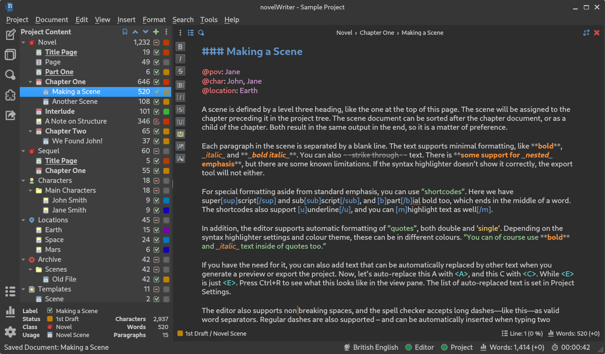
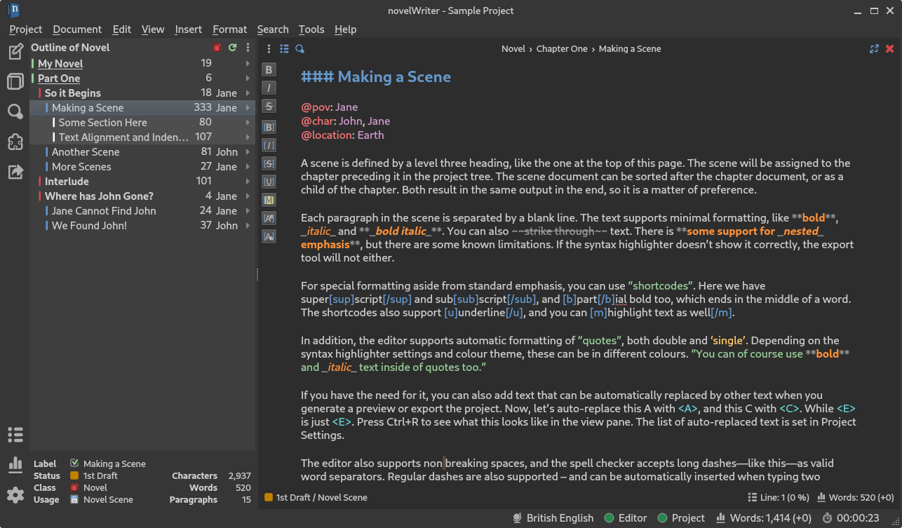

.. _docs_ui_main:

***************
The Main Window
***************

The user interface of novelWriter is intended to be as minimalistic as practically possible, while
at the same time provide useful features needed for writing a novel.

The main window does not by default have an editor toolbar like many other applications do. This
reduces clutter, and since the documents are formatted with style tags, it is not needed most of
the time. Still, a small formatting toolbar can be popped out by clicking the left-most button in
the header of the document editor. It gives quick access to standard formatting codes.

Most formatting features supported are also available through keyboard shortcuts, as well as
available in the main menu under **Format**, so you don't have to look up formatting codes every
time you need them. For reference, a list of all shortcuts can be found in the
:ref:`docs_features_shortcuts` section.

On the left side of the main window you will find a sidebar. This bar has buttons for the standard
views you can switch between, a quick link to the **Build Manuscript** tool, and a set of
project-related tools and quick access to settings at the bottom.

Project Tree and Editor View
============================

   A screenshot of the Project Tree and Editor View.

When **Project Tree View** in the sidebar is selected, the work area is split in two, or
optionally three, panels. The left-most panel contains the project tree and all the documents in
your project. The second panel is the document editor.

An optional third panel on the right side contains a document viewer which can view any document in
your project independently of what is open in the document editor. This panel is not intended as a
preview window, although you can use it for this purpose if you wish. For instance if you need to
check that the formatting tags behave as you expect. However, the main purpose of the viewer is for
viewing your notes next to your editor while you're writing.

The editor also has a **Focus Mode** you can toggle either from the menu, from the icon in the
editor's header, or by pressing :kbd:`F8`. When **Focus Mode** is enabled, all the user interface
elements other than the document editor itself are hidden away.

The project tree will highlight with a different background colour the document that is currently
open in the editor.

Drag & Drop
-----------

The project tree allows drag & drop so you to reorder your documents and folders. Moving a document
in the project tree will affect the text's position when you assemble your manuscript in the
**Manuscript Build** tool.

Documents and their folders can be rearranged freely within their root folders. If you move a
**Novel Document** out of a **Novel** folder, it will be converted to a **Project Note**. Notes can
be moved freely between all root folders, but keep in mind that if you move a note into a **Novel**
type root folder, its "Importance" setting will be replaced by a "Status" setting. See
:ref:`docs_usage_project_status` for more details. The old value will not be overwritten though,
and should be restored if you move it back at some point.

Root folders in the project tree cannot be dragged and dropped at all. If you want to reorder them,
you can move them up or down with respect to each other using the arrow buttons at the top of the
project tree, or by pressing :kbd:`Ctrl+Up` or :kbd:`Ctrl+Down` when they are selected.

.. tip::

   You can drag and drop documents onto the editor or viewer panel to open them.

   .. versionadded:: 2.6

.. tip::

   You can now select multiple items in the project tree by holding down the :kbd:`Ctrl` or
   :kbd:`Shift` key while selecting items.

   .. versionadded:: 2.2

.. _docs_ui_main_novel:

Novel View and Editor View
==========================

   A screenshot of the Novel Tree and Editor View.

When **Novel Tree View** in the sidebar is selected, the project tree is replaced by an overview of
your novel structure for a specific **Novel** type root folder. Instead of showing individual
documents, the tree now shows all headings of your text. This includes multiple headings within the
same document.

Each heading is indented according to the heading level, not its parent/child relationship to other
elements of your project. You can open and edit your novel documents from this view as well. All
headings contained in the currently open document should be highlighted in the view to indicate
which ones belong together in the same document.

If you have multiple **Novel** type root folders, the header of the novel view becomes a dropdown
box. You can then switch between them by clicking the :guilabel:`Outline of ...` text. You can also
click the novel icon button next to it.

Generally, the novel view should update when you make changes to the novel structure, including
edits of the current document in the editor. The information is only updated when the automatic
save of the document is triggered, or you manually press :kbd:`Ctrl+S` to save changes. (You can
adjust the auto-save interval in **Preferences**.) You can also regenerate the whole novel view by
pressing the refresh button in the novel view header.

It is possible to show an optional third column in the novel view. The settings are available from
the menu button in the toolbar.

If you click the triangular icon to the right of each item, a tooltip will pop out showing all the
meta data collected for that heading.

.. note::

   You cannot reorganise the entries in the novel view, or add any new documents, as that would
   imply restructuring the content of the documents themselves. Any such editing must be done in
   the project tree. However, you can add new headings to existing documents, or change references,
   which will be updated in this view when the document is saved.

.. _docs_ui_main_outline:

Novel Outline View
==================

.. figure:: images/fig_outline_view.png

   A screenshot of the Novel Outline View.

When **Novel Outline View** in the sidebar is selected, the tree, editor and viewer are replaced by
a table that shows the entire novel structure with all the tags and references listed. You can
select which novel folder to display from the dropdown menu. You can optionally choose to show a
combination of all novel folders.

Pretty much all collected meta data is available in this view. You can select which columns to
display from the menu button. This includes various meta data and information extracted from your
:ref:`docs_usage_tags_refs`. The order of the columns can also be changed by dragging them to a
different position. You column settings are saved between sessions on a per-project basis.

.. note::

   The **Title** column cannot be disabled or moved.

The information viewed in the outline is based on the project index. While novelWriter does its
best to keep the index up to date when contents change, you can always rebuild it manually by
pressing :kbd:`F9` if something isn't right.

The outline view itself can be regenerated by pressing the refresh button. By default, the content
is refreshed each time you switch to this view.

The **Synopsis** column of the outline view takes its information from a specially formatted
comment. See :ref:`docs_usage_comments_synopsis`.

Project Search
==============

A global search tool is available from the side bar. It allows you to search through your entire
project. The tool does not provide a replace feature. There is a search and replace tool available
in the document editor that acts on the open document. See :ref:`docs_ui_edit_view_search` for more
details.

.. versionadded:: 2.4

Switching Focus
===============

If the project or novel view does not have focus, pressing :kbd:`Ctrl+T` switches focus to
whichever of the two is visible. If one of them already has focus, the key press will switch
between them instead.

Likewise, pressing :kbd:`Ctrl+E` will switch focus to the document editor or viewer, or if any of
them already have focus, it will switch focus between them.

These two shortcuts make it possible to jump between all these GUI elements without having to reach
for the mouse or touchpad.

See :ref:`docs_features_shortcuts` for more details.

Colour Themes
=============

By default, novelWriter uses a light colour theme. You can also choose between a standard dark
theme that have neutral colours, or a series of other included themes, from **Preferences**. 

If you wish, you *can* create your own colour themes, and even have them added to the application.
See :ref:`docs_more_custom_theme` for more details.

Switching the GUI colour theme does not affect the colours of the editor and viewer. They have
separate themes selectable from the "Document colour theme" setting in **Preferences**. They are
separated because there are a lot more options to choose from for the editor and viewer.

.. note::

   If you switch between light and dark mode on the GUI, you should also switch editor theme to
   match, otherwise icons may be hard to see in the editor and viewer.
