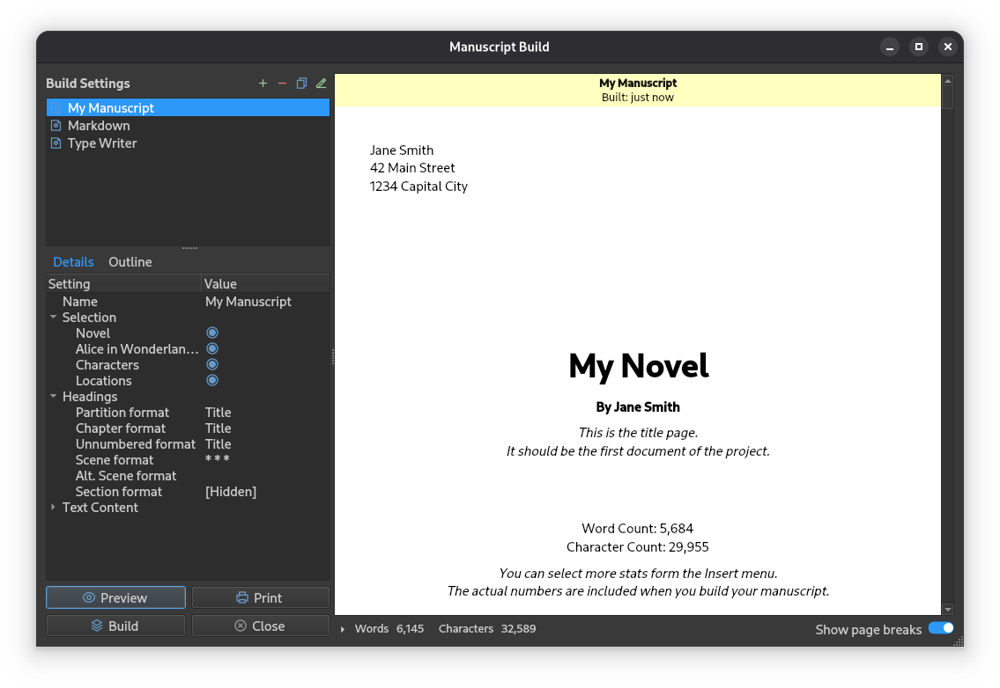
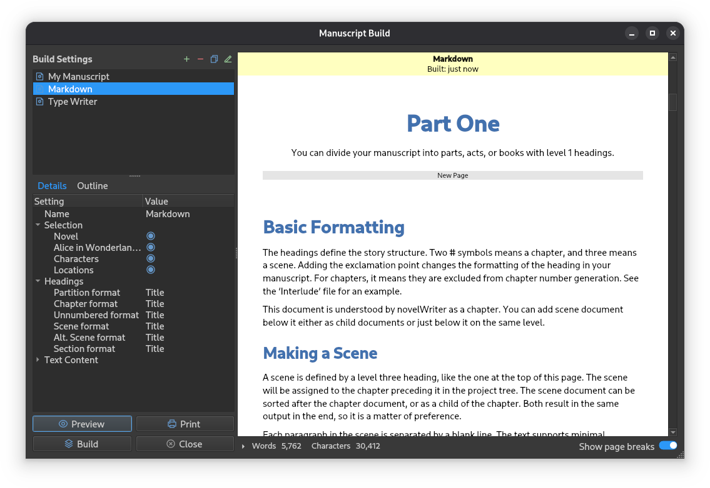
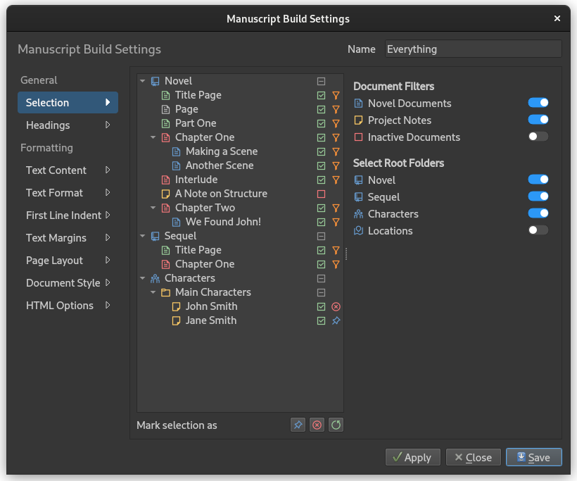
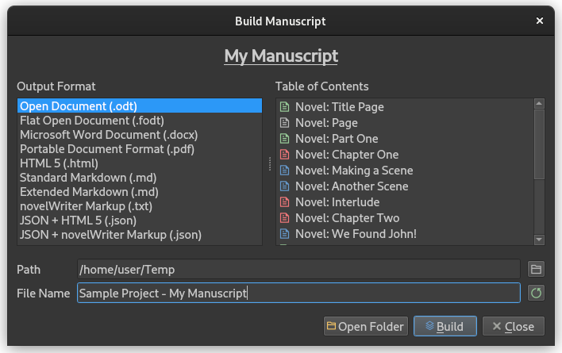

.. _docs_ui_manuscript:

***********************
Building the Manuscript
***********************

.. _Pandoc: https://pandoc.org/

You can at any time build a manuscript, an outline of your notes, or any other type of document
from the text in your project. All of this is handled by the **Manuscript Build** tool. You can
activate it from the sidebar, the **Tools** menu, or by pressing :kbd:`F5`.

.. note::

   The term "Build" in this context means to assemble or generate a single document from a
   selection of your project documents. You can select between multiple standard document formats.

.. versionadded:: 2.1

   This tool is new for version 2.1. A simpler tool was used for earlier versions.

.. _docs_ui_manuscript_main:

The Manuscript Build Tool
=========================

   The **Manuscript Build** tool main window.

The main window of the **Manuscript Build** tool contains a list of all the builds you have
defined, a selection of settings, and a few buttons to generate a preview, open the print dialog, or
run the build to create a manuscript document.

Outline and Word Counts
-----------------------

   The **Manuscript Build** tool main window with the **Outline** visible.

The **Outline** tab on the left lets you navigate the headings in the preview document. It will
show up to scene level headings for novel documents, and level 2 headings for notes.

A collapsible panel of word and character counts is also available below the preview pane. These
are calculated from the text you have included in the document, and are more accurate counts than
what's available in the project tree since they are counted *after formatting*.

For a detailed description on how they are counted, see :ref:`docs_more_counting`.

.. _docs_ui_manuscript_settings:

Build Settings
==============

You can edit a build definition by opening it in the **Manuscript Build Settings** dialog, either
by double-clicking or by selecting it and pressing the edit button in the toolbar.

.. tip::

   You can keep the **Manuscript Build Settings** dialog open while testing the different options,
   and just hit the :guilabel:`Apply` button to update the preview in the main **Manuscript Build**
   window. When you're happy with the result, you can close the settings.

For detailed information on how to format headings, including how to add chapter numbers, scene
numbers, and other dynamic content, see :ref:`docs_ui_manuscript_formatting`.

.. _docs_ui_manuscript_selection:

Document Selection
------------------

   The **Selections** page of the **Manuscript Build Settings** dialog.

The **Selections** page allows you to fine tune which documents are included in the build. The
included documents are indicated by an icon in the last column. The interface is split into two
parts: a project tree on the left showing all documents, and filter options on the right.

You can override the result of these filters by marking one or more documents and selecting to
explicitly include or exclude them by using the buttons below the tree view. The last button can be
used to reset the override and return control to the filter settings.

In the figure, the orange icon and the blue icon indicate which documents are included, and the
red icon indicates that a document is explicitly excluded.

By default, inactive documents are excluded, but you can override this in the filter settings.
See :ref:`docs_usage_project_active` for more details.

Root Folder Selection
^^^^^^^^^^^^^^^^^^^^^

At the bottom of the filter options on the right, you will find a set of switches for each root
folder in your project. These allow you to quickly include or exclude entire root folders from the
build. For example, you can use this to exclude all your notes if you only want the novel content,
or exclude all story content if you want to build an outline of your notes instead.

When a root folder switch is off, all documents within that folder are excluded regardless of the
other filter settings.

.. _docs_ui_manuscript_content:

Content Filtering
-----------------

The options in **Document Selection** and **Root Folder Selection** decide which whole documents
are part of the build.

The content filtering options in the **Formatting** page are different: they only control which
parts of the selected documents are included in the output.

For further content filtering options, see :ref:`docs_ui_manuscript_formatting_options`.

.. _docs_ui_manuscript_build_manage:

Build Management
----------------

The main **Manuscript Build** tool window provides several controls for managing your build
definitions:

**Create a New Build**
   Press the :guilabel:`Add` button (or plus icon) in the toolbar to create a new build definition.
   A new build will be created with default settings that you can then customise.

**Edit a Build**
   Double-click on a build in the list, or select it and press the :guilabel:`Edit` button to open
   the **Manuscript Build Settings** dialog.

**Duplicate a Build**
   Select a build and press the :guilabel:`Duplicate` button (or copy icon) to create a copy of it.
   This is useful for creating variations of a build without starting from scratch. The duplicated
   build will have "2" appended to its name.

**Delete a Build**
   Select a build and press the :guilabel:`Delete` button (or minus icon) to remove it. This action
   cannot be undone, so make sure you have saved any settings you want to keep.

**Reorder Builds**
   You can drag and drop builds in the list to change their order. The order is saved automatically
   when you close the tool.

.. _docs_ui_manuscript_stats:

Statistics View
---------------

Below the preview panel, there is a collapsible statistics widget showing word and character counts
for the current build. Press the expand button (arrow icon) to toggle between a minimal and detailed
view.

The **Minimal View** shows:

- Total word count
- Total character count

The **Detailed View** shows:

- Total words, words in titles, words in text
- Total characters, characters in titles, characters in text
- Total word characters (letters and numbers only), broken down by section

These statistics are calculated from the text you have included in the document after all
formatting has been applied, making them more accurate than the counts available in the project
tree. For a detailed explanation of how text is counted, see :ref:`docs_more_counting`.

.. _docs_ui_manuscript_build:

Building Manuscript Documents
=============================

   The **Build Manuscript** dialog used for writing the actual manuscript documents.

When you press the :guilabel:`Build` button on the **Manuscript Build** tool main window, a special
file dialog opens up. This is where you pick your desired output format and where to write the
file.

On the left side of the dialog is a list of all the available file formats, and on the right, a
list of the documents which are included based on the build definition you selected. You can choose
an output path, and set a base file name as well. The file extension will be added automatically.

To generate the manuscript document, press the :guilabel:`Build` button. A small progress bar will
show the build progress, but for small projects it may pass very fast.

File Formats
------------

The following document formats are supported:

Open Document
   The Build tool can produce either an ``.odt`` file, or an ``.fodt`` file. The latter is just a
   flat version of the document format as a single XML file. Most rich text editors support the
   former, and only a few the latter.

Microsoft Word Document
   The Microsoft Word Document format writes a single ``.docx`` file. It uses a fairly basic format
   that should be compatible with most rich text editors.

Portable Document Format (PDF)
   The PDF is generated from a copy of the preview document, and should have the same formatting
   capabilities as the preview. It's identical to what is produced if you select the print option
   and print to PDF.

novelWriter HTML
   The HTML format writes a single ``.htm`` file with minimal style formatting. The HTML document
   is suitable for further processing by document conversion tools like Pandoc_, for importing in
   word processors, or for printing from browser.

Standard/Extended Markdown
   The Markdown format comes in both Standard and Extended flavour. The *only* difference in terms
   of novelWriter functionality is the support for strike through text, which is not supported by
   the Standard flavour.

novelWriter Markup
   This is simply a concatenation of the project documents selected by the filters into a ``.txt``
   file. The documents are stacked together in the order they appear in the project tree, with
   comments, tags, etc. included if they are selected. This is a useful format for exporting the
   project for later import back into novelWriter.

.. versionadded:: 2.6

   Microsoft Word and PDF output options were added.

Additional Formats
------------------

In addition to the above document formats, the novelWriter HTML and Markup formats can also be
wrapped in a JSON file. These files will have a meta data entry and a body entry.

The text body is saved in a two-level list. The outer list contains one entry per document, in the
order they appear in the project tree. Each document is then split up into a list as well, with one
entry per paragraph it contains.

These files are mainly intended for scripted post-processing for those who want that option. A JSON
file can be imported directly into a Python dict object or a PHP array, to name a few options.

.. _docs_ui_manuscript_print:

Printing
========

The :guilabel:`Print` button allows you to print the content in the preview window. You can either
print to one of your system's printers, or select PDF as your output format from the printer icon
on the print dialog.

.. note::

   The paper format should default to whatever your system default is. If you want to change it,
   you have to select it from the **Print Preview** dialog.
