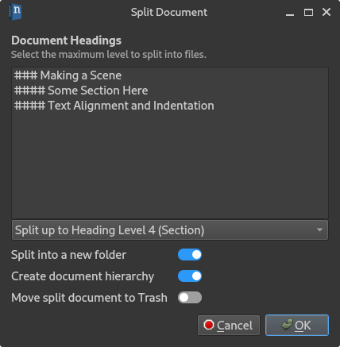
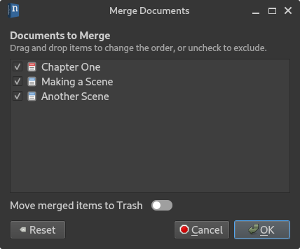

.. _docs_ui_split_merge:

*************************
Split and Merge Documents
*************************

Under the **Transform** submenu in the context menu of an item in the project tree, you will find
several options on how to change a document or folder. This includes changing between document and
note, but also splitting them into multiple documents, or merging child items into a single
document.

Splitting Documents
===================

   The **Split Document** dialog.

The **Split Document by Headings** option will open a dialog that allows you to split the selected
document into multiple new documents based on the headings it contains. You can select at which
heading level the split is to be performed from the dropdown box. The list box will preview which
headings will be split into new documents.

You are given the option to create a folder for these new documents, and whether or not to create a
hierarchy of documents. That is, put sections under scenes, and scenes under chapters.

The source document *is not* deleted in the process, but you have the option to let the tool move
the source document to the **Trash** folder.

Merging Documents
=================

   The **Merge Documents** dialog.

You have two options for merging documents that are child elements of another document. You can
either **Merge Child Items into Self** and **Merge Child Items into New**. The first option will
pull all content of child items and merge them into the parent document, while the second option
will create a new document in the process.

When merging documents in a folder, only the latter option is possible, so only the choice
**Merge Documents in Folder** is available.

In either case, the **Merge Documents** dialog will let you exclude documents you don't want to
include, and it also lets you reorder them if you wish.
